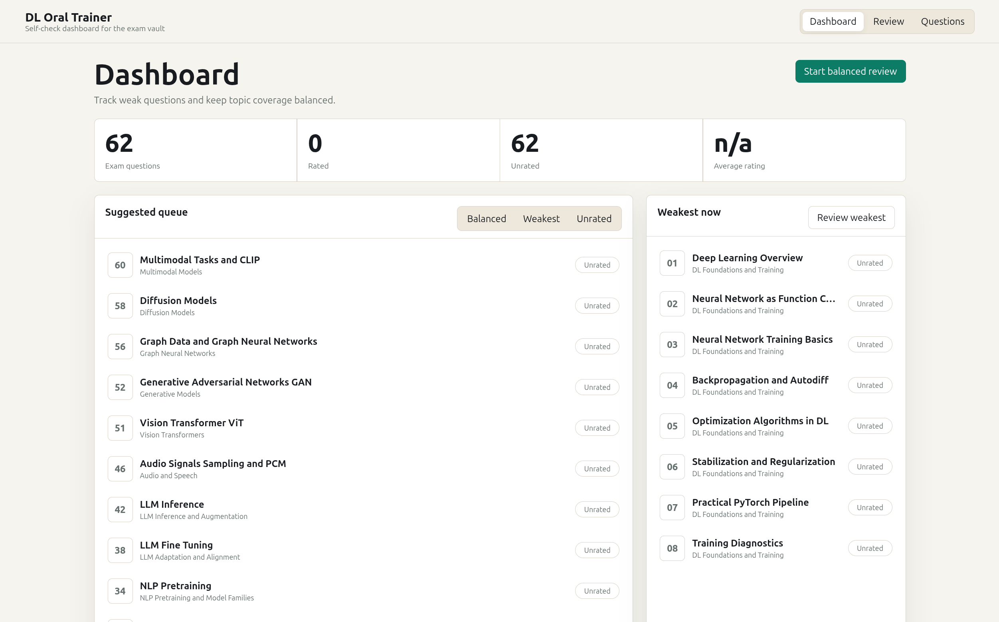

# Deep Learning Exam Vault



Compact Obsidian vault for preparing for the Deep Learning oral exam. The vault
contains 62 question notes grouped by topic, plus a local self-check trainer for
tracking confidence and review coverage.

## Local Trainer

The trainer is a local web app that reads the Markdown notes as source material.
It does not modify the notes during normal use. Your ratings are stored locally
in `trainer/data/progress.json`, which is ignored by git.

Main workflow:

- open a balanced, weakest, unrated, or random review queue;
- answer the original question from memory;
- reveal the compact note;
- rate confidence from 1 to 5;
- use the dashboard to find weak questions and uneven topic coverage.

## Setup

Create a Python virtual environment and install dependencies:

```bash
python3 -m venv .venv
source .venv/bin/activate
pip install -r requirements.txt
```

Run the trainer:

```bash
source .venv/bin/activate
uvicorn trainer.backend.main:app --host 127.0.0.1 --port 8000
```

Then open:

```text
http://127.0.0.1:8000
```

Formulas and Mermaid diagrams are rendered by local frontend assets in
`trainer/frontend/vendor/`. These files are checked into the vault, so npm is
not required for normal use. To refresh them after changing `package.json`:

```bash
npm install
npm run vendor
```

## Checks

Run the built-in verification:

```bash
source .venv/bin/activate
python -m trainer.backend.checks
```

The check verifies that the app can parse exactly 62 question notes, sees 18
topics, builds a suggested queue, and can write/read progress data in a temporary
file. It also verifies that the local MathJax and Mermaid browser assets exist.

## Progress Data

Persistent study progress lives in:

```text
trainer/data/progress.json
```

The repository includes `trainer/data/progress.example.json` as the empty
template. The real progress file is local-only so personal ratings are not
published.

The file is keyed by question number and stores:

- current rating from 1 to 5;
- review count;
- last reviewed timestamp;
- rating history;
- optional note field for future use.

For API tests that should not affect real progress, set:

```bash
TRAINER_PROGRESS_PATH=/tmp/dl-trainer-test-progress.json
```

## Git

This directory has been initialized as a git repository. `.gitignore` excludes
the virtual environment, Python caches, and common build artifacts.
