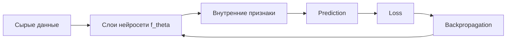

# Deep Learning Overview

Source: `DL_exam.pdf`, Question 01

Original question:

> Введение в Deep Learning. Чем глубокое обучение отличается от классического ML, зачем нужны нейросети, какие типы данных и задач они хорошо обрабатывают.

## Главная идея

`Deep Learning` - это часть ML, где модель является глубокой нейросетью: композицией обучаемых слоев с нелинейностями. Главная польза - `representation learning`: вместо ручного проектирования признаков сеть сама строит полезные представления из сырых данных и вместе с ними учит решающее правило.

## Минимум для ответа

- Классический ML часто: данные -> ручные признаки -> модель. DL чаще: сырые данные -> нейросеть -> признаки и prediction учатся совместно.
- Нейросеть задает отображение $f_\theta: X \to Y$, где $\theta$ - веса и bias.
- Глубина дает иерархию признаков: пиксели -> края -> части -> объект; токены -> локальный контекст -> дальние зависимости.
- Нелинейности обязательны: без них композиция слоев остается одним линейным преобразованием.
- Хорошо подходит для изображений, текста, речи, видео, временных рядов, графов, мультимодальных данных.
- Типичные задачи: classification, regression, segmentation, detection, ASR, machine translation, generation, recommendation, anomaly detection.
- Сильные стороны: end-to-end обучение, меньше ручного `feature engineering`, transfer learning, масштабирование по данным/модели/compute.
- Ограничения: нужны данные или pretraining, дорогое обучение, слабая интерпретируемость, переобучение, `distribution shift`, spurious correlations.
- DL не всегда лучше: на малых табличных задачах `gradient boosting`, линейные модели или SVM часто проще и надежнее.

## Формулы / схема

Базовая supervised-постановка:

$$
\theta^*=\arg\min_\theta \frac{1}{N}\sum_{i=1}^{N}L(f_\theta(x_i),y_i)+\lambda\Omega(\theta)
$$

Слой сети:

$$
h_l=\sigma(W_lh_{l-1}+b_l), \quad \hat{y}=g(h_L)
$$

Обучающий цикл: split данных -> выбор архитектуры -> forward pass -> loss -> `backpropagation` -> update параметров -> validation/test.

## Диаграмма

## Уточнения экзаменатора

- Почему нужны нелинейности? Композиция линейных слоев эквивалентна одному линейному слою.
- Что такое `representation learning`? Обучение внутренних признаков модели под целевую функцию.
- Что значит end-to-end? Вся цепочка от входа до выхода оптимизируется одним loss.
- Почему DL требует много данных? Много параметров и высокая выразительность повышают риск запоминания train set.
- Где классический ML лучше? Малые табличные данные, строгая интерпретируемость, простые хорошо заданные признаки.

## Частые ошибки

- Говорить, что DL всегда превосходит классический ML.
- Сводить DL только к числу слоев, забывая про нелинейности, данные, loss и оптимизацию.
- Путать параметры модели с гиперпараметрами.
- Игнорировать validation/test и обобщение.
- Называть статистические представления нейросети гарантированным "пониманием".
