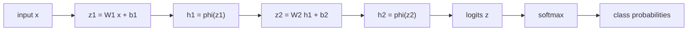

# Neural Network as Function Composition

Source: `DL_exam.pdf`, Question 02

Original question:

> Нейронная сеть как композиция функций. Линейный слой, bias, функции активации, глубина, нелинейность, softmax.

## Главная идея

Нейронная сеть - это параметризованная композиция простых функций: каждый слой строит новое представление из предыдущего. Типичный блок: affine-преобразование $z = Wx + b$ и нелинейная активация $h=\phi(z)$. Глубина дает последовательное преобразование признаков, а нелинейности делают сеть выразительнее одного линейного классификатора.

## Минимум для ответа

- Сеть задает функцию $f_\theta(x)=f_L \circ \dots \circ f_1(x)$, где $\theta$ - обучаемые веса и bias.
- `Linear layer` в DL обычно фактически affine: $z=Wx+b$; строго линейное отображение не содержит $b$.
- `Bias` сдвигает гиперплоскость/порог нейрона; без него разделяющие поверхности сильнее привязаны к началу координат.
- Активация $\phi$ вводит нелинейность: ReLU, sigmoid, tanh, GELU, Leaky ReLU.
- Без активаций несколько линейных слоев сворачиваются в один affine-слой: глубина сама по себе не помогает.
- Глубина полезна для иерархических признаков, но усложняет оптимизацию: vanishing/exploding gradients, насыщение, зависимость от инициализации.
- Последний слой классификатора обычно выдает `logits`; `softmax` превращает их в вероятности классов.

## Формулы / схема

Forward pass:

$$
h_0=x,\quad z_l=W_lh_{l-1}+b_l,\quad h_l=\phi_l(z_l)
$$

Для выхода классификатора:

$$
p_i=\operatorname{softmax}(z)_i=\frac{\exp(z_i)}{\sum_{j=1}^{K}\exp(z_j)}
$$

Устойчивый вариант:

$$
p_i=\frac{\exp(z_i-m)}{\sum_j \exp(z_j-m)},\quad m=\max_j z_j
$$

Для выбора класса softmax не обязателен: $\arg\max_i p_i=\arg\max_i z_i$.

## Диаграмма

## Уточнения экзаменатора

- Чем linear отличается от affine? Linear: $Wx$; affine: $Wx+b$.
- Зачем bias? Он задает сдвиг и обучаемый порог нейрона.
- Почему нужна нелинейность? Иначе композиция слоев снова равна одному affine-преобразованию.
- Что такое logits? Сырые выходы до softmax, не вероятности.
- Почему `CrossEntropyLoss` часто принимает logits? Так численно устойчивее: softmax и log объединяются внутри loss.

## Частые ошибки

- Называть $Wx+b$ строго линейным отображением.
- Думать, что глубина без активаций увеличивает выразительность.
- Применять softmax перед `CrossEntropyLoss` в PyTorch.
- Считать logits вероятностями.
- Забывать, что sigmoid/tanh могут насыщаться и ухудшать градиенты.
