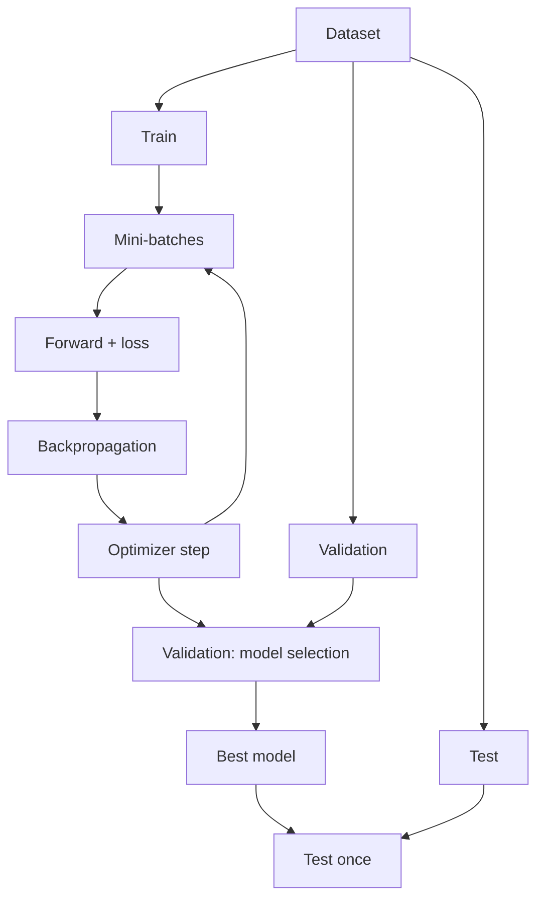

# Neural Network Training Basics

Source: `DL_exam.pdf`, Question 03

Original question:

> Обучение нейронной сети. Функция потерь, эмпирический риск, mini-batch training, train/validation/test split.

## Главная идея

Обучение нейронной сети - это подбор параметров $\theta$ модели $f_\theta(x)$ так, чтобы уменьшить ошибку не только на известных примерах, но и на новых данных. Истинный риск на распределении данных неизвестен, поэтому его заменяют эмпирическим риском - средним loss на train-выборке. Mini-batch training делает это вычислимо: градиент считают по небольшому случайному batch, а качество и переобучение контролируют через validation и test.

## Минимум для ответа

- Дано: выборка $D=\{(x_i,y_i)\}_{i=1}^n$, модель $f_\theta$, loss $\ell(f_\theta(x),y)$.
- Loss - дифференцируемая обучающая цель; metric - показатель качества задачи, например accuracy или F1, не обязан быть удобным для оптимизации.
- Параметры - веса и bias; гиперпараметры - learning rate, batch size, число эпох, архитектура, регуляризация.
- `train` обновляет параметры; `validation` выбирает гиперпараметры, checkpoint и early stopping; `test` используется один раз для финальной оценки.
- `iteration` - один optimizer step по mini-batch; `epoch` - один проход по train.
- Главные риски: overfitting, data leakage, подбор решений по test, неправильный split зависимых или несбалансированных данных.

## Формулы / схема

Ожидаемый риск:
$$
R(\theta)=\mathbb{E}_{(x,y)\sim p_{\text{data}}}[\ell(f_\theta(x),y)].
$$

Эмпирический риск:
$$
\hat R_D(\theta)=\frac{1}{n}\sum_{i=1}^n \ell(f_\theta(x_i),y_i).
$$

Mini-batch loss и SGD step:
$$
\hat R_B(\theta)=\frac{1}{|B|}\sum_{i\in B}\ell(f_\theta(x_i),y_i),\qquad
\theta_{t+1}=\theta_t-\eta\nabla_\theta\hat R_B(\theta_t).
$$

Pipeline: split data -> shuffle train -> mini-batch -> forward -> loss -> backpropagation -> optimizer step -> validation -> best checkpoint -> final test.

## Диаграмма

## Уточнения экзаменатора

- Почему mini-batch gradient стохастический? Batch выбирается случайно, поэтому градиент шумный, но при равномерном сэмплировании в среднем оценивает полный train-gradient.
- Чем validation отличается от test? Validation участвует в выборе модели; test должен оставаться независимым.
- Зачем нужен learning rate? Он задает размер шага; слишком большой ведет к расходимости, слишком маленький - к медленному обучению.
- Когда нужен stratified split? При дисбалансе классов, чтобы сохранить пропорции классов в split.

## Частые ошибки

- Считать эмпирический риск истинным риском.
- Путать loss и metric.
- Подбирать гиперпараметры по test.
- Делать preprocessing по всей выборке до split.
- Делить временные ряды случайно, смешивая будущее и прошлое.
