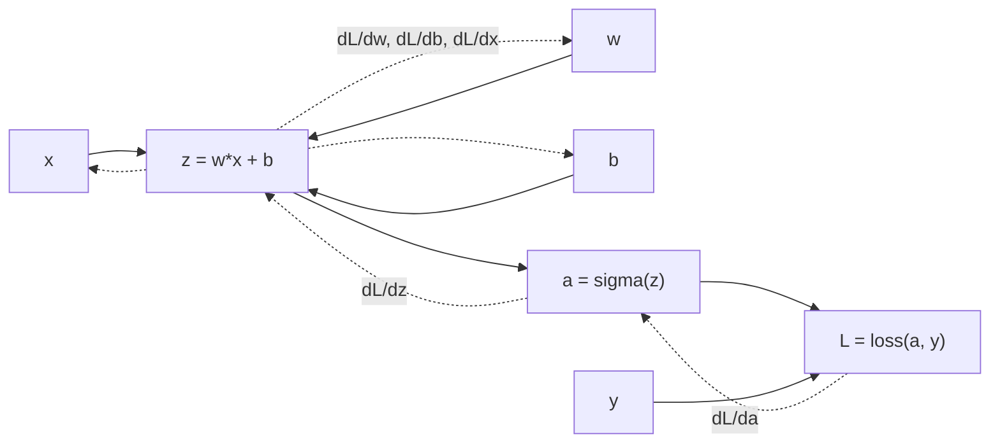

# Backpropagation and Autodiff

Source: `DL_exam.pdf`, Question 04

Original question:

> Backpropagation и автоматическое дифференцирование. Вычислительный граф, правило цепочки, forward-mode и reverse-mode autodiff.

## Главная идея

Нейросеть - это композиция простых дифференцируемых операций. `Backpropagation` считает градиенты loss по параметрам, применяя правило цепочки по вычислительному графу в обратном порядке. Это частный случай `reverse-mode automatic differentiation`: сначала `forward pass` вычисляет значения и сохраняет активации, затем `backward pass` распространяет производные от скалярного loss назад.

## Минимум для ответа

- Вычислительный граф: DAG, где узлы - значения/операции, ребра - зависимости.
- `Forward pass`: вычислить все промежуточные значения в топологическом порядке.
- `Backward pass`: для каждого узла хранить adjoint $\bar v=\frac{\partial L}{\partial v}$ и суммировать вклады из всех путей.
- `Autodiff` отличается от symbolic differentiation и finite differences: не выводит огромную формулу и не приближает через $\epsilon$, а механически применяет локальные правила chain rule.
- `Forward-mode` эффективно считает `JVP` $Jv$: удобно, когда входов мало или нужна производная по направлению.
- `Reverse-mode` эффективно считает `VJP` $v^TJ$: удобно для DL, потому что параметров много, а loss обычно один скаляр.
- Цена reverse-mode: память под сохраненные активации; компромисс - checkpointing и пересчет.

## Формулы / схема

Для операции $y=f(x_1,\dots,x_k)$:

$$
\bar{x_i} \mathrel{+}= J_{f,x_i}^T\bar y
$$

Если переменная используется в нескольких ветвях:

$$
\bar v=\sum_{u\in children(v)}\bar u\frac{\partial u}{\partial v}
$$

Алгоритм: построить граф -> выполнить forward -> поставить $\bar L=1$ -> пройти граф назад -> накопить $\nabla_\theta L$ -> передать градиенты оптимизатору.

## Диаграмма

## Уточнения экзаменатора

- Почему reverse-mode хорош для обучения? Один backward pass дает градиенты по всем параметрам scalar loss.
- Что такое JVP/VJP? $Jv$ - forward-mode, $v^TJ$ или $J^T v$ - reverse-mode.
- Почему градиенты аккумулируются? Один узел может влиять на loss по нескольким путям.
- Зачем хранить активации? Локальные производные часто зависят от значений forward pass.

## Частые ошибки

- Называть backpropagation оптимизатором; это только способ вычислить градиенты.
- Путать autodiff с численными разностями.
- Забывать суммирование вкладов в разветвленном графе.
- Считать, что все операции дифференцируемы: `argmax`, `detach`, дискретный выбор и in-place изменения могут ломать путь градиента.
