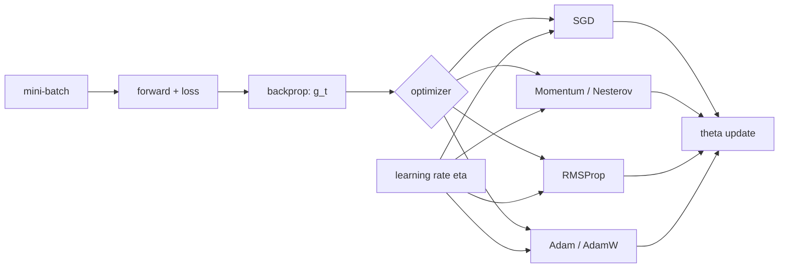

# Optimization Algorithms in DL

Source: `DL_exam.pdf`, Question 05

Original question:

> Оптимизация в DL. Gradient descent, SGD, Momentum, Nesterov, RMSProp, Adam/AdamW, роль learning rate.

## Главная идея

Оптимизация в DL превращает градиент loss из `backpropagation` в обновление параметров. Градиент показывает направление локального роста, поэтому при минимизации идем против него. Оптимизаторы отличаются сглаживанием шума, учетом истории, покоординатным масштабированием и регуляризацией. `Learning rate` задает масштаб шага и часто важнее выбора метода.

## Минимум для ответа

- Цель: минимизировать empirical risk $J(\theta)$, часто с регуляризацией $\Omega(\theta)$.
- `Gradient descent`: полный градиент по датасету; точнее, но дорого.
- `Mini-batch SGD`: градиент по batch $B_t$; шумно, дешево, удобно для GPU.
- `Momentum`: хранит скорость, уменьшает зигзаги, ускоряет устойчивые направления.
- `Nesterov`: считает градиент в lookahead-точке, куда ведет momentum.
- `RMSProp`: хранит среднее квадратов градиента и делит шаг на $\sqrt{s_t}$.
- `Adam`: объединяет momentum первого момента и RMSProp-подобный второй момент, использует bias correction.
- `AdamW`: Adam с decoupled weight decay; это не то же самое, что просто L2 внутри градиента Adam.
- Большой $\eta$ дает скачки, расходимость, `NaN`; маленький - медленное обучение.

## Формулы / схема

$$
\min_\theta J(\theta)=\frac{1}{N}\sum_i \ell(f_\theta(x_i),y_i)+\Omega(\theta),\quad
g_t \approx \nabla_\theta J(\theta_t)
$$

$$
\text{SGD:}\quad \theta_{t+1}=\theta_t-\eta g_t,\quad
g_t=\frac{1}{|B_t|}\sum_{i\in B_t}\nabla_\theta \ell_i(\theta_t)
$$

$$
\text{Momentum:}\quad v_t=\mu v_{t-1}+g_t,\quad \theta_{t+1}=\theta_t-\eta v_t
$$

$$
\text{RMSProp:}\quad s_t=\rho s_{t-1}+(1-\rho)g_t^2,\quad
\theta_{t+1}=\theta_t-\eta\frac{g_t}{\sqrt{s_t}+\epsilon}
$$

$$
\text{Adam:}\quad m_t=\beta_1m_{t-1}+(1-\beta_1)g_t,\quad
v_t=\beta_2v_{t-1}+(1-\beta_2)g_t^2
$$

$$
\hat m_t=\frac{m_t}{1-\beta_1^t},\quad
\hat v_t=\frac{v_t}{1-\beta_2^t},\quad
\theta_{t+1}=\theta_t-\eta\frac{\hat m_t}{\sqrt{\hat v_t}+\epsilon}
$$

$$
\text{AdamW:}\quad
\theta_{t+1}=(1-\eta\lambda)\theta_t-\eta\frac{\hat m_t}{\sqrt{\hat v_t}+\epsilon}
$$

## Диаграмма

## Уточнения экзаменатора

- Почему SGD стохастический? Градиент зависит от случайного batch.
- Что делает momentum? Экспоненциально сглаживает направления и уменьшает колебания.
- Чем Nesterov отличается? Градиент считается в lookahead-точке.
- Зачем bias correction в Adam? Начальные $m_t$ и $v_t$ смещены к нулю.
- Почему AdamW важен? Weight decay применяется отдельно от adaptive-нормировки.

## Частые ошибки

- Идти по градиенту, а не против него.
- Считать, что adaptive optimizer отменяет подбор $\eta$.
- Путать второй момент Adam с Hessian.
- Называть AdamW обычным Adam с L2-регуляризацией.
- Забывать про $\epsilon$, schedule, warmup и validation quality.
