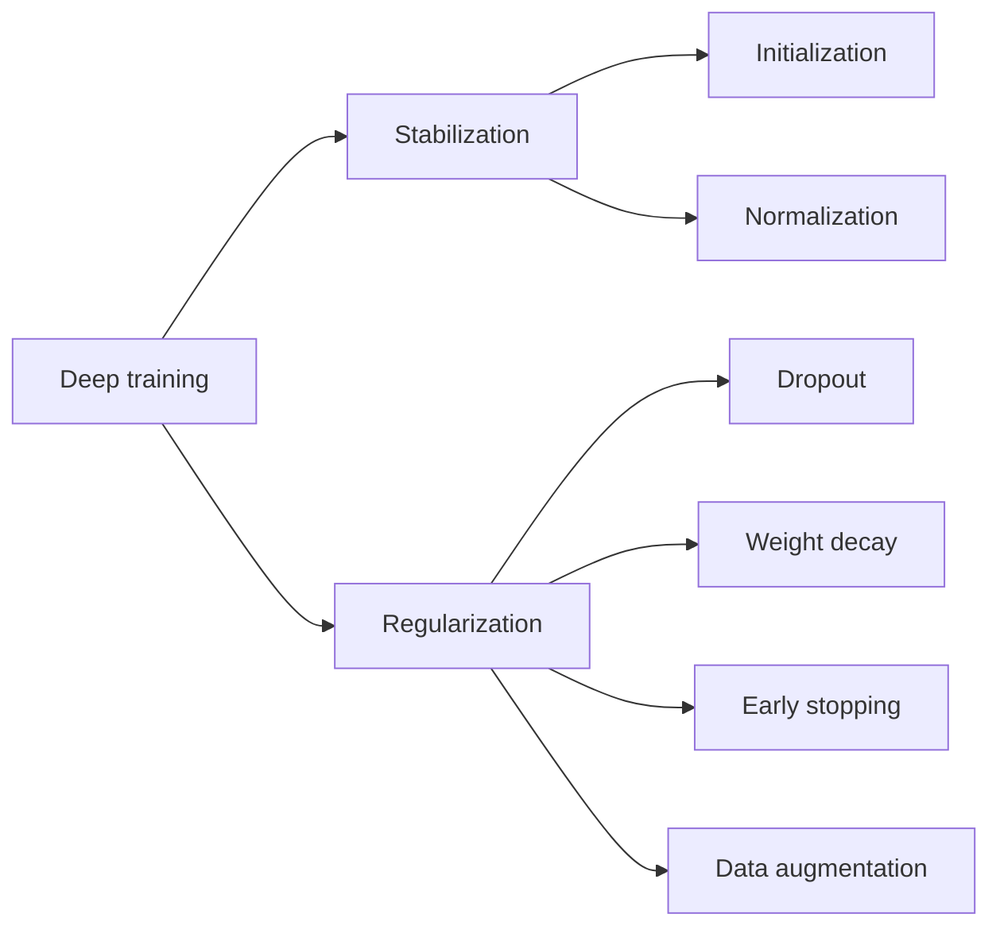

# Stabilization and Regularization

Source: `DL_exam.pdf`, Question 06

Original question:

> Стабилизация и регуляризация обучения. Инициализация, нормализация, dropout, weight decay, early stopping, data augmentation.

## Главная идея

Стабилизация делает оптимизацию управляемой: нормальные масштабы активаций, градиентов и шагов. Регуляризация улучшает обобщение: не дает сети просто запомнить train-выборку. На практике приемы пересекаются: BatchNorm стабилизирует и слегка регуляризует шумом mini-batch, а augmentation одновременно расширяет данные и задает нужные инвариантности.

## Минимум для ответа

- Инициализация сохраняет дисперсию сигналов по слоям. Xavier/Glorot обычно для `tanh`/`sigmoid`, He/Kaiming для ReLU-подобных активаций.
- Нормализация убирает плохие масштабы: input normalization по train-статистикам; BatchNorm по mini-batch в `train()` и running statistics в `eval()`; LayerNorm по признакам одного объекта, поэтому удобна в Transformers.
- `Dropout` в обучении зануляет активации с вероятностью $p$ и мешает co-adaptation нейронов. В `eval()` выключается.
- `Weight decay` штрафует большие веса и снижает эффективную сложность. Для SGD L2 и weight decay эквивалентны; для Adam лучше decoupled вариант AdamW.
- `Early stopping` выбирает лучший checkpoint по validation metric и останавливает обучение после `patience` эпох без улучшения.
- `Data augmentation` применяет label-preserving преобразования: crop, flip, color jitter, noise, time/frequency masking и т.п. Нельзя применять train-only augmentation к validation/test.
- Слишком слабая регуляризация ведет к overfitting, слишком сильная - к underfitting.

## Формулы / схема

Empirical risk с регуляризацией:

$$
J(\theta)=\frac{1}{n}\sum_i \ell(f_\theta(x_i),y_i)+\Omega(\theta)
$$

Идея инициализации для слоя $z_j=\sum_i w_{ji}x_i$:

$$
\operatorname{Var}(z_j)\approx \text{fan\_in}\operatorname{Var}(w)\operatorname{Var}(x)
$$

Xavier: $\operatorname{Var}(w)=\frac{2}{\text{fan\_in}+\text{fan\_out}}$; He: $\operatorname{Var}(w)=\frac{2}{\text{fan\_in}}$.

BatchNorm: $\hat x=\frac{x-\mu_B}{\sqrt{\sigma_B^2+\epsilon}}$, $y=\gamma\hat x+\beta$.

Inverted dropout: $m_i\sim \operatorname{Bernoulli}(1-p)$, $\tilde h_i=\frac{m_i}{1-p}h_i$.

L2/SGD:

$$
\theta_{t+1}=(1-\eta\lambda)\theta_t-\eta\nabla_\theta \hat R_{\text{train}}(\theta_t)
$$

## Диаграмма

## Уточнения экзаменатора

- Почему He для ReLU? ReLU зануляет часть активаций, нужна большая дисперсия весов.
- Чем BatchNorm отличается от LayerNorm? BatchNorm зависит от batch-статистик, LayerNorm нормализует признаки одного объекта.
- Почему AdamW? Он отделяет decay весов от адаптивного масштабирования градиента.
- Что сохраняет augmentation? Семантику label и допустимые инвариантности задачи.

## Частые ошибки

- Путать стабилизацию оптимизации и регуляризацию обобщения.
- Забывать переключать `train()`/`eval()` для dropout и BatchNorm.
- Считать L2 и weight decay всегда одинаковыми, включая Adam.
- Считать последний checkpoint лучшим вместо лучшего по validation.
