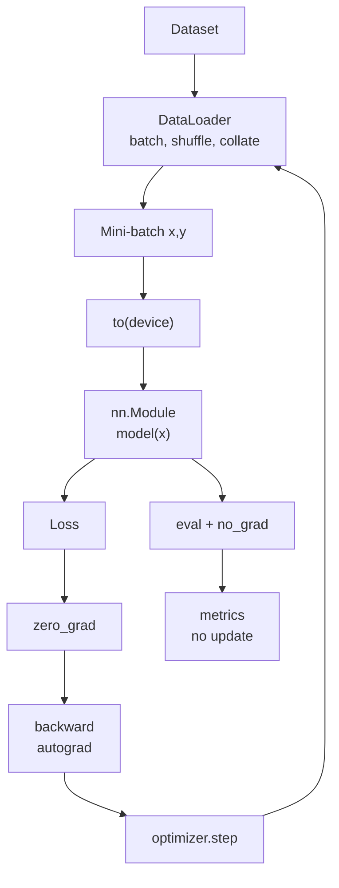

# Practical PyTorch Pipeline

Source: `DL_exam.pdf`, Question 07

Original question:

> Практический PyTorch-пайплайн. Tensor, autograd, nn.Module, Dataset, DataLoader, train/eval.

## Главная идея

PyTorch-пайплайн переводит задачу $\min_\theta L(f_\theta(x), y)$ в воспроизводимый код: данные идут через `Dataset` и `DataLoader`, модель задается как `nn.Module`, `autograd` считает градиенты, optimizer обновляет параметры. Важно помнить: PyTorch дает блоки и динамический граф, но training loop обычно пишет пользователь.

## Минимум для ответа

- `Tensor` - многомерный массив с `shape`, `dtype`, `device`, опционально `requires_grad=True`; входы, target и параметры должны быть на совместимом `device`.
- `autograd` строит граф во время forward pass и после `loss.backward()` заполняет `.grad` у параметров.
- Градиенты накапливаются, поэтому перед обычным backward нужен `optimizer.zero_grad()`.
- `nn.Module` хранит слои, параметры, buffers; `model(x)` вызывает `forward` через служебную логику модуля.
- `Dataset`: один пример через `__getitem__`, размер через `__len__`.
- `DataLoader`: mini-batch, `shuffle`, `num_workers`, `collate_fn`, `drop_last`, `pin_memory`.
- `train()` и `eval()` меняют поведение слоев: `dropout`, `BatchNorm`. Они не включают и не выключают autograd.
- Для validation/test: `model.eval()` плюс `torch.no_grad()` или `torch.inference_mode()`.
- Для `CrossEntropyLoss` нужны logits и target типа `long`; `softmax` заранее не применяют.

## Формулы / схема

Mini-batch objective:

$$
L_B(\theta)=\frac{1}{m}\sum_{i=1}^{m}\ell(f_\theta(x_i), y_i)
$$

SGD-идея:

$$
\theta_{t+1}=\theta_t-\eta\nabla_\theta L_B(\theta_t)
$$

Train step: `to(device)` -> `logits = model(x)` -> `loss` -> `zero_grad()` -> `backward()` -> `step()`.

Eval step: `model.eval()` -> `no_grad()` -> forward -> loss/metrics -> без `step()`.

## Диаграмма

## Уточнения экзаменатора

- Чем `eval()` отличается от `no_grad()`? `eval()` меняет режим модулей, `no_grad()` не строит граф.
- Почему нужен `zero_grad()`? `.grad` суммируется между backward-вызовами.
- Что делает `DataLoader` сверх `Dataset`? Собирает batch, перемешивает, параллелит загрузку, применяет `collate_fn`.
- Почему optimizer получает `model.parameters()`? Это список обучаемых tensors с `.grad`.
- Когда нужен `detach()`? Когда надо остановить gradient flow, например для logging или target values.

## Частые ошибки

- Забыть `zero_grad()` или случайно обновлять модель на validation.
- Считать validation без `eval()` или без `no_grad()`.
- Смешать CPU/GPU tensors или неверные `dtype` target'ов.
- Применить `softmax` или `argmax` до `CrossEntropyLoss`.
- Создать обучаемый tensor без `nn.Parameter`, вызвать `model.forward(x)` напрямую, разорвать граф через `.item()` внутри loss.
