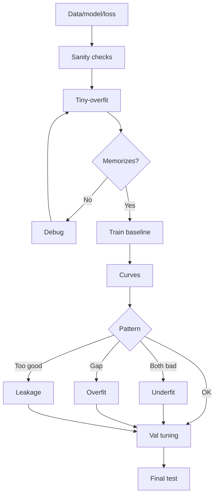

# Training Diagnostics

Source: `DL_exam.pdf`, Question 08

Original question:

> Диагностика обучения нейросети. Переобучение, tiny-overfit test, анализ train/validation curves, leakage, подбор гиперпараметров.

## Главная идея

Диагностика отвечает: модель не учится из-за бага, плохой оптимизации, малой емкости, переобучения, неверного split или нечестной оценки. Порядок: tiny-overfit, `train/validation curves`, проверка `leakage`, затем подбор гиперпараметров.

## Минимум для ответа

- `Tiny-overfit`: 1-2 batch или 10-100 объектов, слабая регуляризация, цель - почти нулевой train loss. Если не вышло: labels, shapes, loss, `optimizer.step()`, LR, `train/eval`, preprocessing.
- `Overfitting`: train хорош, validation/test хуже, gap растет. Лечение: данные, augmentation, `weight decay`, `dropout`, label smoothing, early stopping, меньшая модель.
- `Underfitting`: плохи train и validation; gap мал. Лечение: больше capacity, дольше обучение, другой LR/optimizer, слабее регуляризация.
- `Leakage`: validation/test или target попали в train, features, preprocessing или selection. Симптом - подозрительно высокая validation.
- Гиперпараметры выбирают по validation, не по test: LR, batch size, optimizer, scheduler, weight decay, dropout, epochs, architecture.

## Формулы / схема

Риски:

$$
\hat R_{train}=\frac{1}{n_{train}}\sum_i \ell(f_\theta(x_i),y_i), \quad
\hat R_{val}=\frac{1}{n_{val}}\sum_i \ell(f_\theta(x_i),y_i)
$$

Generalization gap для loss: $\mathrm{gap}=\hat R_{val}-\hat R_{train}$. Лучший checkpoint:

$$
t^*=\arg\min_t \hat R_{val}(\theta_t)
$$

Схема: sanity checks $\rightarrow$ tiny-overfit $\rightarrow$ baseline $\rightarrow$ curves $\rightarrow$ leakage $\rightarrow$ tuning по validation $\rightarrow$ test один раз.

## Диаграмма

## Уточнения экзаменатора

- Зачем tiny-overfit? Проверить training loop, loss, optimizer и данные.
- Почему test нельзя трогать? Он станет частью выбора модели, оценка будет оптимистичной.
- Почему validation лучше train? Augmentation/dropout, легкий validation или leakage.
- Как искать leakage? Дубликаты, group/time split, target-derived features, fit preprocessing только на train.

## Частые ошибки

- Подбирать LR и архитектуру до tiny-overfit.
- Делать normalization/imputation/vocabulary fit на всех данных до split.
- Путать `model.train()` и `model.eval()`.
- Подавать `softmax` в `CrossEntropyLoss` вместо raw logits.
- Судить по accuracy при дисбалансе классов.
- Считать любой gap ошибкой: важны динамика validation и метрика.
