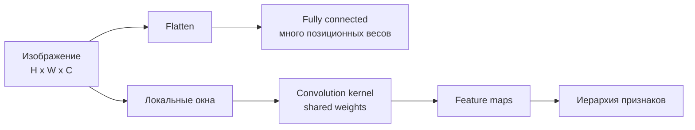

# Images as Tensors and CNN Motivation

Source: `DL_exam.pdf`, Question 09

Original question:

> Изображение как тензор и мотивация CNN. Почему полносвязная сеть плохо использует структуру изображения.

## Главная идея

Изображение - это тензор с пространственной структурой. Соседние пиксели связаны, локальные признаки повторяются в разных местах, а небольшой сдвиг объекта не должен менять смысл радикально. Fully connected сеть после `flatten` не имеет встроенного знания о соседстве и переносимости признаков. CNN добавляет правильный inductive bias: локальные receptive fields, shared weights и иерархию признаков.

## Минимум для ответа

- Grayscale: $H \times W$, RGB: $H \times W \times C$; в PyTorch: объект $C \times H \times W$, batch $N \times C \times H \times W$.
- Пиксель - вектор каналов; значения нормализуют из $[0,255]$ в $[0,1]$ или стандартизуют.
- `Flatten` переводит $X$ в $x \in \mathbb{R}^{HWC}$: информация численно остается, но явная 2D-структура не задана архитектурой.
- FC слой учит отдельные веса для каждой позиции: один и тот же край слева и справа приходится распознавать разными параметрами.
- CNN применяет один kernel ко всем позициям: меньше параметров, лучшее обобщение, translation equivariance.
- Глубина дает иерархию: края/текстуры -> части объектов -> высокоуровневые признаки.
- Ограничение: обычная CNN не гарантирует invariance к масштабу, повороту, occlusion; нужны augmentation, pooling/stride или специальные архитектуры.

## Формулы / схема

Представление:

$$
X \in \mathbb{R}^{H \times W \times C}, \quad X_\text{batch} \in \mathbb{R}^{N \times C \times H \times W}.
$$

FC после `flatten`:

$$
h = \phi(Wx+b), \quad \#\text{params}_\text{FC}=(HWC)M+M.
$$

Свертка:

$$
Y_{i,j,k}=b_k+\sum_u\sum_v\sum_c K_{u,v,c,k}X_{i+u,j+v,c}, \quad \#\text{params}_\text{conv}=rsC_\text{in}C_\text{out}+C_\text{out}.
$$

Сдвиг: $\operatorname{Conv}(T_\Delta X) \approx T_\Delta \operatorname{Conv}(X)$ без учета границ.

## Диаграмма

## Уточнения экзаменатора

- **Equivariance vs invariance?** Equivariance: feature map сдвигается вместе с входом. Invariance: итоговый ответ почти не меняется.
- **Почему параметров меньше?** Kernel переиспользуется; число весов зависит от размера фильтра и каналов, а не от $H,W$.
- **Что такое receptive field?** Область входа, влияющая на активацию; в глубоких слоях растет.
- **Можно ли FC для изображений?** Можно, но обычно статистически и вычислительно неэффективно.

## Частые ошибки

- Говорить, что `flatten` уничтожает данные; он уничтожает архитектурный bias соседства.
- Путать translation equivariance и invariance.
- Забывать, что фильтр имеет глубину $C_\text{in}$.
- Считать CNN автоматически устойчивой ко всем геометрическим преобразованиям.
