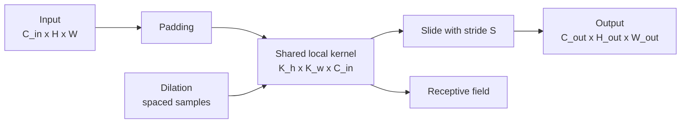

# Операция свертки

Source: `DL_exam.pdf`, Question 10

Original question:

> Операция свертки. Локальность, разделение весов, padding, stride, receptive field, dilation.

## Главная идея

Свертка в CNN - это обучаемый локальный фильтр, скользящий по изображению с одними весами во всех позициях. Локальность ищет признаки в малых окнах, `weight sharing` уменьшает параметры и дает translation equivariance: при сдвиге входа feature map примерно сдвигается так же.

## Минимум для ответа

- Вход: $X \in \mathbb{R}^{C_{in} \times H \times W}$; веса: $W \in \mathbb{R}^{C_{out} \times C_{in} \times K_h \times K_w}$.
- В DL обычно используется cross-correlation без переворота ядра, но ее называют convolution.
- Локальность: активация зависит от patch входа, а не от всего изображения.
- Разделение весов: один фильтр применяется во всех координатах; параметры не зависят от $H,W$.
- `padding` добавляет рамку и контролирует размер выхода; `valid` - без padding, `same` обычно сохраняет размер при $S=1$.
- `stride` - шаг окна; $S>1$ уменьшает разрешение и вычисления.
- `dilation` разрежает точки ядра, увеличивая контекст без новых весов.
- `receptive field` - область исходного входа, влияющая на конкретную активацию; в глубокой CNN растет от слоя к слою.

## Формулы / схема

Одна пространственная ось:

$$
H_{out} = \left\lfloor \frac{H + 2P - D(K - 1) - 1}{S} + 1 \right\rfloor
$$

Эффективный размер ядра:

$$
K_{eff} = D(K - 1) + 1
$$

Число параметров с bias:

$$
\#params = C_{out}(C_{in}K_hK_w + 1)
$$

Рост receptive field: $r_l = r_{l-1} + (K_l - 1)D_lj_{l-1}$, $j_l = j_{l-1}S_l$.

## Диаграмма

## Уточнения экзаменатора

- Почему не fully connected? Локальность и намного меньше параметров.
- Equivariance или invariance? Свертка дает equivariance; invariance обычно появляется через pooling, global average pooling или augmentation.
- Что делает dilation? Увеличивает $K_{eff}$ и receptive field без роста числа весов.
- Почему две свертки $3 \times 3$ популярны? Receptive field $5 \times 5$, меньше параметров, есть нелинейность.

## Частые ошибки

- Забыть, что фильтр смотрит по всем входным каналам.
- Путать `padding` с `stride`: первое про границы и размер, второе про шаг и downsampling.
- Называть сверточный слой полностью инвариантным к сдвигам.
- Использовать формулу выхода без члена dilation или с неверным $-1$.
- Думать, что dilation увеличивает число параметров.
