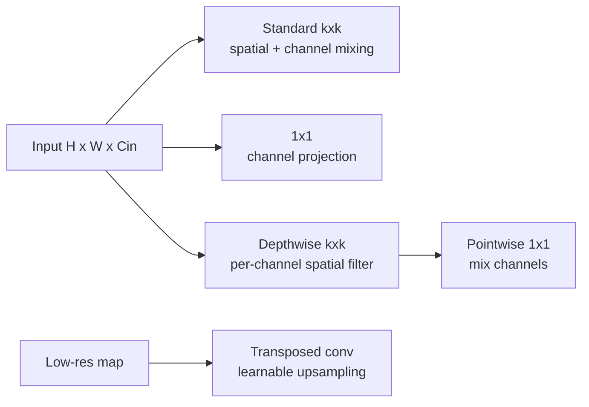

# Efficient and Specialized Convolutions

Source: `DL_exam.pdf`, Question 12

Original question:

> Виды сверток и эффективные операции. 1x1 convolution, separable/depthwise convolution, transposed convolution.

## Главная идея

Обычная $k \times k$ convolution одновременно фильтрует локальную spatial-окрестность и смешивает каналы, поэтому стоит дорого: $k^2 C_{in} C_{out}$ параметров. Эффективные свертки либо разделяют эти роли, либо используют дешевое channel mixing, либо меняют spatial resolution.

## Минимум для ответа

- `1x1 convolution`: одна и та же linear projection для вектора каналов в каждой позиции: смешивает каналы, меняет $C_{in} \to C_{out}$, строит bottleneck/projection. Receptive field сама не увеличивает.
- `Depthwise convolution`: отдельный $k \times k$ spatial filter для каждого входного канала; в PyTorch обычно `groups=C_in`. Каналы почти не взаимодействуют.
- `Depthwise separable convolution`: `depthwise kxk` + `pointwise 1x1`; сначала дешевые spatial filters, потом channel mixing. Основа MobileNet-подобных сетей.
- `Grouped convolution`: компромисс; каналы делятся на $g$ групп, смешивание идет только внутри группы.
- `Spatial separable convolution` не то же самое: раскладывает ядро $k \times k$ на $k \times 1$ и $1 \times k$.
- `Transposed convolution`: learnable upsampling, связанный с умножением на $A^\top$ для матричной записи convolution. Это не настоящая inverse convolution.

## Формулы / схема

$$
\text{Params}_{standard}=k^2 C_{in} C_{out}, \qquad
\text{Params}_{1 \times 1}=C_{in}C_{out}
$$

$$
\text{Params}_{dw-sep}=k^2 C_{in}+C_{in}C_{out}, \qquad
\frac{\text{dw-sep}}{\text{standard}}=\frac{1}{C_{out}}+\frac{1}{k^2}
$$

Размер transposed convolution для одной оси:

$$
H_{out}=(H_{in}-1)s-2p+d(k-1)+\text{output\_padding}+1
$$

Практически экономия MACs не гарантирует такое же wall-clock ускорение: важны memory bandwidth, layout, batch size и оптимизация kernels.

## Диаграмма

## Уточнения экзаменатора

- Чем `1x1` отличается от fully connected? Сохраняет spatial grid и применяет одну матрицу ко всем позициям.
- Почему depthwise без pointwise слабее? Нет cross-channel interactions.
- Что означает `groups=C_in`? Depthwise convolution при подходящем числе выходных каналов.
- Почему transposed convolution дает checkerboard artifacts? Из-за uneven overlap при неудачных $k$ и $s$.
- Альтернативы upsampling: `resize + convolution`, `PixelShuffle`, unpooling, bilinear initialization.

## Частые ошибки

- Называть transposed convolution обратной сверткой без оговорки.
- Думать, что `1x1` смотрит на соседние пиксели.
- Путать depthwise separable и spatial separable.
- Забывать, что `output_padding` выбирает размер, а не добавляет обучаемые пиксели.
- Считать depthwise separable всегда лучше: она дешевле, но может снизить accuracy и быть memory-bound.
