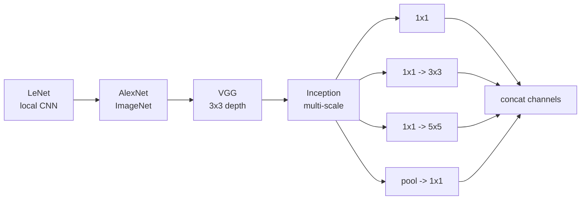

# Classic CNN Architectures

Source: `DL_exam.pdf`, Question 13

Original question:

> Классические CNN-архитектуры. LeNet, AlexNet, VGG, Inception: как развивались идеи глубины, сверток и feature extraction.

## Главная идея

Классические `CNN` показывают переход от маленьких сетей для цифр к глубоким feature extractors. Общий шаблон: `conv -> activation -> downsampling -> classifier`; вглубь сети уменьшаются $H,W$, растут каналы и receptive field, а признаки переходят от edges/textures к частям объектов и class-level representations.

## Минимум для ответа

- `LeNet-5`: цифры; convolution, subsampling/pooling, FC-classifier. Вклад: local receptive fields, weight sharing, learned features.
- `AlexNet`: ImageNet-scale CNN; GPU, `ReLU`, max pooling, augmentation, dropout, крупные ранние kernels. Вклад: deep CNN победила hand-crafted pipelines.
- `VGG`: повторяющиеся $3 \times 3$ conv-блоки и max pooling; `VGG-16/19`. Вклад: глубина через маленькие kernels.
- `Inception` / `GoogLeNet`: parallel branches $1 \times 1$, $3 \times 3$, $5 \times 5$, pooling, concat по каналам. Вклад: multi-scale extraction и $1 \times 1$ bottlenecks.
- Ограничения: тяжелые FC-head у AlexNet/VGG, сложная оптимизация без residual connections, локальный inductive bias плохо ловит дальние зависимости.

## Формулы / схема

Receptive field при stride 1, dilation 1:

$$
r_L = 1 + \sum_{l=1}^{L}(K_l - 1)
$$

Для $L$ сверток $3 \times 3$: $r_L = 1 + 2L$.

Параметры свертки без bias:

$$
\#params = K^2 C_{in} C_{out}
$$

Bottleneck перед $K \times K$:

$$
\#params = C_{in}C_{mid} + K^2 C_{mid}C_{out}, \quad C_{mid} \ll C_{in}
$$

## Диаграмма

## Уточнения экзаменатора

- Почему $3 \times 3$ вместо $5 \times 5$? Две $3 \times 3$ дают field $5 \times 5$, $18C^2$ параметров вместо $25C^2$ и дополнительную `ReLU`.
- Что делает $1 \times 1$ conv? Смешивает каналы в каждой spatial position и меняет их число.
- Почему AlexNet важна? Не изобрела CNN, а масштабировала их на ImageNet.
- Feature extractor vs head? Conv-часть строит признаки, head дает logits.

## Частые ошибки

- Перечислять архитектуры без тренда: глубже, эффективнее, меньше ручного feature engineering.
- Путать translation equivariance свертки с полной инвариантностью.
- Считать pooling обучаемой сверткой.
- Забывать trade-off `VGG`: простой backbone, но много параметров и вычислений.
