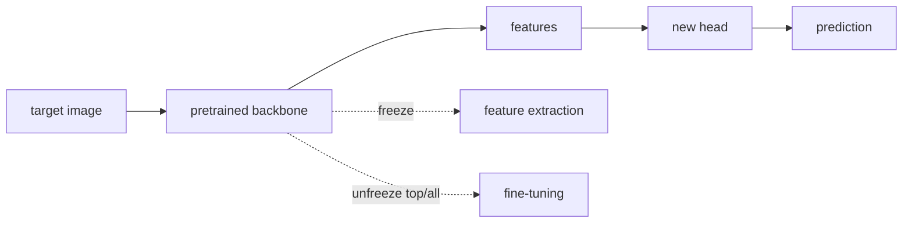

# Transfer Learning in Computer Vision

Source: `DL_exam.pdf`, Question 15

Original question:

> Transfer learning в компьютерном зрении. Feature extraction, fine-tuning, заморозка слоев, использование предобученных backbone.

## Главная идея

`Transfer learning` в CV: берем модель, уже обученную на большой визуальной задаче, и используем ее веса как старт для новой задачи. Обычно старая сеть дает `backbone` $g_\theta$ для признаков, а новая `head` $h_\phi$ решает классификацию, detection или segmentation. Это экономит разметку и compute, потому что ранние слои уже знают края, текстуры и формы.

## Минимум для ответа

- `Backbone`: основная сеть без старой task-specific головы; примеры: ResNet, EfficientNet, ConvNeXt, ViT, Swin.
- `Feature extraction`: заморозить `backbone`, обучать только новую `head`. Хорошо при малом датасете, похожем домене и ограниченном compute.
- `Fine-tuning`: инициализировать веса из pretraining и обновлять часть или всю модель на target dataset.
- Заморозка слоев: параметры не получают optimizer update; в PyTorch обычно `requires_grad=False`.
- Практический рецепт: загрузить pretrained weights, заменить head, сохранить preprocessing pretraining, обучить head, затем при необходимости разморозить верхние блоки.
- Чем меньше данных и ближе домен, тем больше заморозка; чем сильнее domain shift и больше данных, тем больше fine-tuning.
- Важно: разные learning rates для `backbone` и `head`, аккуратность с `BatchNorm`, validation, augmentation, early stopping.

## Формулы / схема

Модель:

$$
f(x)=h_\phi(g_\theta(x))
$$

`Feature extraction`:

$$
\theta=\theta_s,\quad \phi^*=\arg\min_\phi \mathbb{E}_{D_t}\mathcal{L}(h_\phi(g_{\theta_s}(x)),y)
$$

`Fine-tuning`:

$$
(\theta^*,\phi^*)=\arg\min_{\theta,\phi}\mathbb{E}_{D_t}\mathcal{L}(h_\phi(g_\theta(x)),y),\quad \theta_0=\theta_s
$$

Обычно $\eta_{\text{backbone}}\ll\eta_{\text{head}}$, чтобы не разрушить полезные pretrained признаки.

## Диаграмма

## Уточнения экзаменатора

- Чем отличается `feature extraction` от `fine-tuning`? В первом `backbone` фиксирован, во втором обновляется хотя бы часть его весов.
- Почему нижние слои часто замораживают? Они кодируют более универсальные признаки: края, цвета, текстуры.
- Когда размораживать всю модель? При большом target dataset или сильном отличии домена от source.
- Что с `BatchNorm`? Даже при frozen weights running statistics могут меняться в `train()`; часто замороженный backbone держат в `eval()`.
- Что такое negative transfer? Перенос ухудшает качество из-за плохого mismatch source и target или неправильной адаптации.

## Частые ошибки

- Путать замену `head` с обучением всей модели с нуля.
- Забыть поменять число выходных классов.
- Использовать preprocessing, не совпадающий с pretraining normalization.
- Fine-tune весь backbone большим learning rate на маленьком датасете.
- Считать, что transfer learning всегда лучше: при сильном mismatch это не гарантировано.
