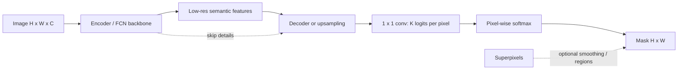

# Semantic Segmentation

Source: `DL_exam.pdf`, Question 16

Original question:

> Семантическая сегментация. Постановка задачи, отличие от классификации, FCN, encoder-decoder подход, superpixels.

## Главная идея

Семантическая сегментация - это `pixel-wise classification`: модель не просто говорит, какие классы есть на изображении, а присваивает класс каждому пикселю. Выход - плотная маска $H \times W$; разные экземпляры одного класса не различаются.

## Минимум для ответа

- Постановка: для $X \in \mathbb{R}^{H \times W \times C}$ предсказать $Y \in \{1,\dots,K\}^{H \times W}$.
- Классификация: один label или вектор вероятностей на изображение. Сегментация: label для каждой spatial position, нужна локализация.
- Detection дает bounding boxes, semantic segmentation дает pixel mask, instance segmentation еще разделяет экземпляры.
- Сеть выдает logits $Z \in \mathbb{R}^{H \times W \times K}$; softmax считается по классам отдельно в каждом пикселе.
- `FCN`: заменить fully connected слои классификационной CNN на convolutional, обычно добавить $1 \times 1$ convolution для $K$ каналов и upsampling до исходного размера.
- `Encoder-decoder`: encoder уменьшает разрешение и строит семантические признаки; decoder восстанавливает маску. Skip connections возвращают границы и мелкие детали.
- `Superpixels`: связные однородные области по цвету/текстуре/близости. Их можно классифицировать или сглаживать ими маску, но они не понимают семантику.

## Формулы / схема

Pixel-wise softmax:

$$
p_\theta(y_{ij}=k \mid X)=
\frac{\exp Z_{ijk}}{\sum_{c=1}^{K}\exp Z_{ijc}}
$$

Предсказание:

$$
\hat{Y}_{ij}=\arg\max_k p_\theta(y_{ij}=k \mid X)
$$

Loss:

$$
\mathcal{L}= -\frac{1}{|\Omega|}\sum_{(i,j)\in\Omega} w_{Y_{ij}}
\log p_\theta(y_{ij}=Y_{ij}\mid X)
$$

где $\Omega$ - размеченные пиксели, $w$ - optional class weights; `ignore index` исключает ненадежные пиксели.

## Диаграмма

## Уточнения экзаменатора

- Почему не обычная CNN? Fully connected head теряет spatial grid и дает один prediction.
- Зачем upsampling? Глубокие признаки обычно имеют размер $H/s \times W/s$, а маска нужна в исходном разрешении.
- Почему skip connections важны? Ранние слои хранят границы, глубокие - семантику.
- Чем semantic отличается от instance segmentation? Semantic не хранит identity отдельных объектов.

## Частые ошибки

- Называть semantic segmentation задачей выделения отдельных объектов.
- Путать маску с bounding boxes.
- Забывать, что softmax применяется отдельно для каждого пикселя.
- Считать superpixels семантической моделью, хотя это низкоуровневая группировка.
