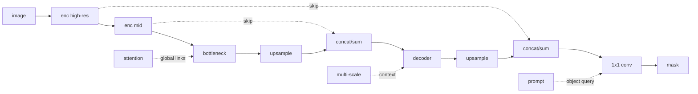

# U-Net and Modern Segmentation

Source: `DL_exam.pdf`, Question 17

Original question:

> U-Net и современные подходы к сегментации. Skip connections, upsampling, multi-scale features, transformer/promptable segmentation как расширения.

## Главная идея

`U-Net` - encoder-decoder для dense prediction: encoder сжимает изображение и извлекает семантику, decoder через upsampling возвращает разрешение маски. Ключ - `skip connections`: глубокие признаки отвечают "что это", ранние помогают восстановить "где граница".

## Минимум для ответа

- Вход: $X \in \mathbb{R}^{H \times W \times C}$, выход: logits $Z \in \mathbb{R}^{H \times W \times K}$, маска $\hat{Y}_{ij}=\arg\max_k Z_{ijk}$.
- Encoder: convolutions + pooling/strided conv; resolution падает, receptive field растет.
- Bottleneck: грубый, но контекстный слой.
- Decoder: `upsampling + conv` и объединение со skip feature map.
- Skip connections обычно делают через `concat`, иногда через summation; concat информативнее, но дороже по каналам.
- `Upsampling`: nearest/bilinear interpolation, transposed convolution, unpooling, pixel shuffle. Практичный вариант - bilinear upsampling + convolution; transposed convolution может давать checkerboard artifacts.
- Multi-scale features нужны для разных размеров: `FPN`, `ASPP`, pyramid pooling, HRNet-like ветви.
- Transformer segmentation добавляет self-attention, но dense output все равно требует decoder и локальных деталей.
- Promptable segmentation принимает image + prompt: point, box, mask, иногда text; часто возвращает class-agnostic маску объекта, а не semantic label.

## Формулы / схема

Decoder level:

$$
D_l=\phi_l(\operatorname{concat}(\operatorname{up}(D_{l+1}),F_l)).
$$

Pixel-wise softmax:

$$
p_{ijk}=\frac{\exp Z_{ijk}}{\sum_{c=1}^{K}\exp Z_{ijc}}.
$$

Типичный loss:

$$
\mathcal{L}=\mathcal{L}_{CE}+\lambda(1-\operatorname{Dice}).
$$

Promptable pipeline: $E_I=g(X)$, $E_P=h(P)$, $\hat{M}=d(E_I,E_P)$.

## Диаграмма

Атрибуция: [assets/ATTRIBUTION.md](../assets/ATTRIBUTION.md).

## Уточнения экзаменатора

- Чем U-Net отличается от FCN? У U-Net полноценный decoder и skip connections для границ.
- Зачем skip connections? Возвращают локализацию после downsampling.
- Почему нужен multi-scale? Малые объекты требуют high-resolution, большие - широкого контекста.
- Что дает transformer? Global context, но полная attention имеет $O(N^2)$.
- Promptable заменяет semantic segmentation? Нет: часто маска class-agnostic, класс нужен отдельно.

## Частые ошибки

- Сводить U-Net только к upsampling и забывать skip connections.
- Путать skip connections U-Net с residual connections ResNet.
- Считать transposed convolution точной inverse convolution.
- Игнорировать выравнивание spatial sizes перед concat.
- Думать, что attention автоматически решает проблему границ.
