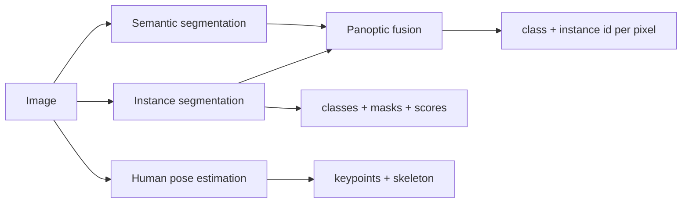

# Instance Panoptic Segmentation and Pose

Source: `DL_exam.pdf`, Question 18

Original question:

> Instance, panoptic segmentation и human pose estimation. Чем эти задачи отличаются от semantic segmentation, какие идеи используются.

## Главная идея

`Semantic segmentation` дает класс каждому пикселю, но не различает объекты. `Instance segmentation` добавляет идентичность экземпляра: каждая машина или человек получает отдельную маску. `Panoptic segmentation` объединяет semantic и instance: все пиксели сцены размечены, `things` имеют instance id, `stuff` имеет только класс. `Human pose estimation` ищет не маски, а keypoints тела и связи между ними.

## Минимум для ответа

- `Semantic`: карта $Y_{ij}=class$, два человека сливаются в один класс `person`.
- `Instance`: набор $\{(c_n,s_n,M_n)\}_{n=1}^N$: класс, confidence, binary mask объекта; обычно только `things`.
- `Mask R-CNN` = detector (`RPN`, boxes, `RoIAlign`) + mask head; loss = classification, box regression, mask loss.
- `Panoptic`: карта $\hat{Y}_{ij}=(class, instance\ id)$; `things` разделяются, `stuff` вроде sky/road не нумеруется.
- В panoptic важна partition-разметка: один пиксель - одна метка, без перекрытия масок.
- `Pose estimation`: выход $\{(x_k,y_k,v_k)\}_{k=1}^K$ для joints и skeleton graph; это localization, не segmentation.
- Стратегии pose: `top-down` = person detector -> keypoint model; `bottom-up` = все keypoints -> grouping в людей.

## Формулы / схема

Instance mask IoU:

$$
IoU(M,\hat{M})=\frac{|M\cap\hat{M}|}{|M\cup\hat{M}|}
$$

Panoptic Quality:

$$
PQ=\frac{\sum_{(p,g)\in TP}IoU(p,g)}{|TP|+\frac{1}{2}|FP|+\frac{1}{2}|FN|}
$$

Heatmap для keypoint:

$$
H_k(u,v)=\exp\left(-\frac{(u-x_k)^2+(v-y_k)^2}{2\sigma^2}\right)
$$

Pipeline: semantic head дает классы пикселей; instance head дает masks/scores; fusion сортирует masks, разрешает конфликты и заполняет оставшиеся пиксели `stuff`.

## Диаграмма

## Уточнения экзаменатора

- Чем instance отличается от semantic? Instance различает объекты одного класса и возвращает набор масок.
- Что такое `things` и `stuff`? `Things` счетные объекты; `stuff` аморфные области без instance id.
- Зачем `RoIAlign`? Чтобы извлекать признаки RoI без грубого округления координат и сохранить alignment маски.
- Top-down или bottom-up pose? Top-down точнее при хорошем detector, bottom-up лучше масштабируется по числу людей, но сложнее grouping.

## Частые ошибки

- Называть panoptic просто instance segmentation: она еще покрывает `stuff` и весь кадр.
- Забывать, что panoptic masks не перекрываются.
- Считать pose segmentation-задачей: она предсказывает keypoints, а не класс каждого пикселя.
- Путать mask AP/IoU с `OKS`, который оценивает keypoints с учетом масштаба объекта.
