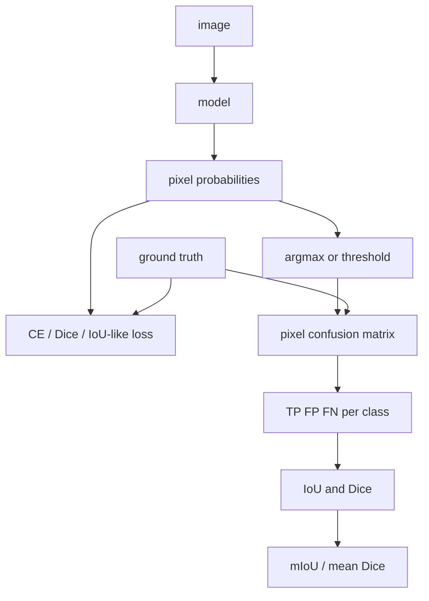

# Segmentation Metrics and Losses

Source: `DL_exam.pdf`, Question 19

Original question:

> Метрики и функции потерь в сегментации. Pixel-wise cross-entropy, IoU/mIoU, Dice/F1, особенности оценки качества.

## Главная идея

В segmentation модель сравнивают с разметкой на уровне пикселей. Loss обучает вероятности, метрики оценивают совпадение масок. `Pixel-wise cross-entropy` удобна и дифференцируема, но фон может доминировать; `IoU`, `mIoU` и `Dice/F1` лучше отражают overlap областей.

## Минимум для ответа

- Выход: logits $Z \in \mathbb{R}^{H \times W \times K}$, затем `softmax` для multiclass или `sigmoid` для binary/multilabel.
- `ignore index`/`void` исключают из loss и confusion matrix.
- CE считает пиксели независимо; при дисбалансе добавляют веса классов, `focal loss`, Dice loss или IoU/Jaccard loss.
- Overlap-метрики считаются one-vs-rest через $TP, FP, FN$; $TN$ обычно не нужен, иначе фон завышает score.
- `mIoU` усредняют по классам evaluation protocol, часто по confusion matrix всего validation set.
- Риски: маленькие объекты, тонкие границы, threshold, absent classes, resizing масок только nearest-neighbor.

## Формулы / схема

Pixel-wise CE по размеченным пикселям $\Omega$:

$$
\mathcal{L}_{CE}=-\frac{1}{|\Omega|}\sum_{i \in \Omega}\log p_{i,y_i},
\qquad
\mathcal{L}_{WCE}=-\frac{1}{|\Omega|}\sum_{i \in \Omega}w_{y_i}\log p_{i,y_i}.
$$

Для класса $k$:

$$
IoU_k=\frac{TP_k}{TP_k+FP_k+FN_k},
\qquad
Dice_k=F1_k=\frac{2TP_k}{2TP_k+FP_k+FN_k}.
$$

$$
mIoU=\frac{1}{|\mathcal{K}_{eval}|}\sum_{k \in \mathcal{K}_{eval}}IoU_k,
\qquad
Dice=\frac{2IoU}{1+IoU}.
$$

Soft Dice loss для binary case:

$$
\mathcal{L}_{Dice}=1-\frac{2\sum_i p_i y_i+\epsilon}{\sum_i p_i+\sum_i y_i+\epsilon}.
$$

Train с $\mathcal{L}_{CE}+\lambda\mathcal{L}_{Dice}$, validate по masks после `argmax` или threshold.

## Диаграмма

## Уточнения экзаменатора

- Почему pixel accuracy плоха? Фон дает высокий score без хороших объектов.
- Чем Dice отличается от IoU? Связан монотонно, но численно выше.
- Почему $TN$ не входит? True negatives огромны и маскируют ошибки.
- Как считать absent class? По протоколу; надежно через accumulated confusion matrix.
- Зачем CE + Dice? CE дает стабильные градиенты, Dice согласует loss с overlap.

## Частые ошибки

- Называть CE метрикой качества, а не training loss.
- Сравнивать Dice и IoU как одинаковые шкалы.
- Включать `ignore`/`void` класс в `mIoU`.
- Считать метрики до `argmax` без явного soft-surrogate.
- Интерполировать ground truth masks bilinear-методом.
