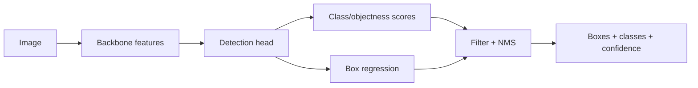

# Object Detection Basics

Source: `DL_exam.pdf`, Question 20

Original question:

> Object detection. Постановка задачи, bounding boxes, confidence, IoU, отличие detection от classification и segmentation.

## Главная идея

`Object detection` решает задачу "что и где": на изображении надо найти все объекты интересующих классов и выдать для каждого прямоугольник, класс и уверенность. В отличие от classification, выход не один label, а множество переменного размера. В отличие от segmentation, локализация грубее: `bounding box`, а не пиксельная маска.

## Минимум для ответа

- Вход: изображение $X \in \mathbb{R}^{H \times W \times C}$.
- Выход: $\hat{Y}=\{(\hat{b}_i,\hat{c}_i,\hat{s}_i)\}_{i=1}^{N}$, где $\hat{b}_i$ - box, $\hat{c}_i$ - класс, $\hat{s}_i$ - confidence.
- `Bounding box` - прямоугольник вокруг видимой области объекта. Форматы: $(x_{\min},y_{\min},x_{\max},y_{\max})$ или $(x_c,y_c,w,h)$.
- `Confidence` нужен для ранжирования и фильтрации: objectness $P(\text{object})$, вероятность класса $P(c \mid \text{object})$ или их произведение.
- Detector обычно совмещает две подзадачи: classification/objectness для кандидата и box regression для координат.
- Сложности: много объектов, фон, перекрытия, разные масштабы, маленькие объекты, дубликаты boxes, class imbalance.

## Формулы / схема

IoU измеряет качество геометрического совпадения двух boxes:

$$
\operatorname{IoU}(A,B)=\frac{|A \cap B|}{|A \cup B|}
=\frac{|A \cap B|}{|A|+|B|-|A \cap B|}.
$$

Значения: $1$ - полное совпадение, $0$ - нет пересечения. IoU не равен confidence: confidence - оценка модели, IoU - геометрическое сравнение.

Типовой pipeline:

1. $F=\operatorname{backbone}(X)$ - извлечь признаки.
2. Сформировать candidates: anchors, grid cells, proposals, queries.
3. Предсказать class/objectness scores и box offsets.
4. Преобразовать offsets в boxes изображения.
5. Отфильтровать по confidence и удалить дубликаты через `NMS`.

Общий loss часто записывают как:

$$
\mathcal{L}=\mathcal{L}_{cls}+\lambda \mathcal{L}_{box}.
$$

## Диаграмма

## Уточнения экзаменатора

- Detection vs classification? Classification дает класс изображения, detection - классы и координаты объектов.
- Detection vs semantic segmentation? Detection возвращает boxes, segmentation - класс каждого пикселя.
- Detection vs instance segmentation? Instance segmentation дает маску экземпляра, detection обычно только box.
- Зачем IoU? Для matching с ground truth, true positive и контроля локализации.
- Что значит confidence? Уверенность в наличии объекта и/или его классе.

## Частые ошибки

- Путать confidence и IoU.
- Забывать, что число объектов на выходе переменное.
- Называть bounding box точной формой объекта.
- Не различать semantic, instance и panoptic segmentation.
- Игнорировать фон, дубликаты и post-processing.
