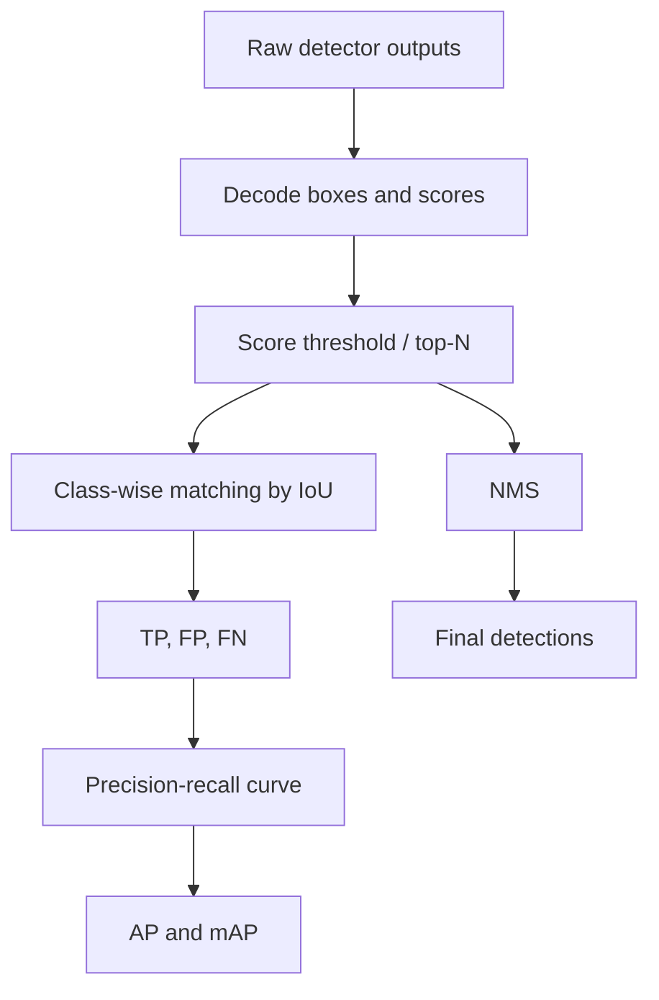

# Detection Metrics and Postprocessing

Source: `DL_exam.pdf`, Question 21

Original question:

> Метрики и post-processing в детекции. Precision/recall, AP/mAP, Non-Maximum Suppression.

## Главная идея

В object detection оценивают класс, локализацию и переменное число boxes. Поэтому predictions сопоставляют с ground truth через `IoU`, считают `TP/FP/FN`, строят precision-recall curve и агрегируют ее в `AP/mAP`. Post-processing, особенно `NMS`, убирает дубликаты одного объекта.

## Минимум для ответа

- Prediction: $(\hat b_i, \hat c_i, \hat s_i)$ - box, class, confidence.
- Matching идет отдельно по классам: predictions сортируют по score и связывают с еще не использованным ground truth максимального IoU.
- `TP`: правильный класс и $\operatorname{IoU}\ge\tau$ с новым ground truth.
- `FP`: фон, неверный класс, плохой box или дубликат уже найденного объекта.
- `FN`: ground truth без подходящего prediction.
- Высокий score threshold повышает precision, но снижает recall; низкий threshold добавляет FP.
- `AP` - площадь под precision-recall curve для одного класса при фиксированном IoU threshold.
- `mAP` - среднее AP по классам; `mAP@0.5` мягче, чем COCO `mAP@[.5:.95]`.
- `NMS` нужен, потому что detector часто дает несколько boxes на один объект.

## Формулы / схема

$$
\operatorname{IoU}(A,B)=\frac{|A\cap B|}{|A\cup B|}
$$

$$
\operatorname{Precision}=\frac{TP}{TP+FP}, \quad
\operatorname{Recall}=\frac{TP}{TP+FN}
$$

$$
\operatorname{AP}=\int_0^1 p(r)\,dr, \quad
\operatorname{mAP}=\frac{1}{K}\sum_{k=1}^{K}\operatorname{AP}_k
$$

Greedy NMS для одного класса: отсортировать boxes по score; взять лучший box; удалить оставшиеся boxes с $\operatorname{IoU}>\theta_{\text{NMS}}$; повторять до конца списка.

## Диаграмма

## Уточнения экзаменатора

- Почему accuracy плоха? Нет фиксированного числа объектов, много фона, важна геометрия.
- Что будет с дубликатом правильного объекта? Первый может быть `TP`, остальные становятся `FP`.
- Чем AP отличается от mAP? AP для класса, mAP усредняет по классам и иногда по IoU thresholds.
- Почему COCO `mAP@[.5:.95]` строже? Высокие thresholds требуют точной локализации.
- Чем опасен NMS? Может удалить близкий реальный объект при слишком низком threshold.

## Частые ошибки

- Считать, что высокий confidence сам делает prediction `TP`.
- Забывать, что один ground truth засчитывается только один раз.
- Путать score threshold для фильтрации и IoU threshold для matching/NMS.
- Считать `mAP@0.5` и `mAP@[.5:.95]` взаимозаменяемыми.
- Не упомянуть, что NMS обычно post-processing и не является основной loss-функцией обучения.
