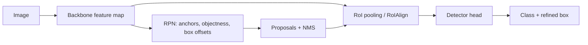

# Two Stage Object Detection

Source: `DL_exam.pdf`, Question 22

Original question:

> Two-stage object detection. Sliding window, R-CNN, Fast R-CNN, Faster R-CNN, Region Proposal Network.

## Главная идея

`Two-stage object detection` сначала находит области-кандидаты (`region proposals`), затем классифицирует их и уточняет bounding box. Это экономит перебор по сравнению со `sliding window` и обычно дает хорошую локализацию, но pipeline сложнее многих `one-stage` detectors.

## Минимум для ответа

- `Sliding window`: классификатор по окнам разных позиций, масштабов и aspect ratios; затем threshold и `NMS`. Минус: много окон и class imbalance.
- `R-CNN`: `Selective Search` дает proposals; каждый crop отдельно проходит CNN; дальше classifier и box regressor. Минусы: медленно, features не переиспользуются.
- `Fast R-CNN`: feature map считается один раз; proposals проецируются на нее; `RoI pooling` делает fixed-size features; head предсказывает class scores и box offsets. Bottleneck: proposals внешние.
- `Faster R-CNN`: добавляет `Region Proposal Network` (`RPN`), которая на shared feature map генерирует proposals. Backbone, RPN и detector head можно обучать совместно.
- `RPN` class-agnostic: предсказывает `objectness` и box offsets для anchors, но не конкретный класс объекта.
- После RPN proposals фильтруются, проходят `NMS`, затем второй stage классифицирует их и уточняет boxes.

## Формулы / схема

Число окон в sliding window:

$$
N_{windows} \approx H'W' \cdot S \cdot R
$$

Multi-task loss:

$$
\mathcal{L}=\mathcal{L}_{cls}+\lambda \mathcal{L}_{box}
$$

RPN loss:

$$
\mathcal{L}_{RPN}=
\frac{1}{N_{cls}}\sum_i \mathcal{L}_{obj}(p_i,p_i^*)
+\lambda \frac{1}{N_{reg}}\sum_i p_i^*\mathcal{L}_{reg}(t_i,t_i^*)
$$

$p_i^*=1$ для positive anchors, поэтому regression только для них. Anchors размечают по `IoU`: high - positive, low - negative, промежуточные игнорируют.

## Диаграмма

## Уточнения экзаменатора

- Чем R-CNN отличается от Fast R-CNN? R-CNN считает CNN для каждого proposal; Fast R-CNN переиспользует feature map.
- Чем Fast R-CNN отличается от Faster R-CNN? Proposals генерирует обучаемая RPN, а не внешний метод.
- Что предсказывает RPN? `Objectness` и offsets для anchors.
- Зачем `NMS`? Удалить дублирующиеся boxes с большим overlap.
- Почему это two-stage? Сначала class-agnostic proposals, затем class-aware classification и box refinement.

## Частые ошибки

- Говорить, что RPN сразу предсказывает классы объектов.
- Забывать, что box loss считается только для foreground/positive anchors.
- Смешивать `RoI pooling` и генерацию proposals: RoI pooling извлекает признаки, а не ищет области.
- Называть Faster R-CNN одностадийным, потому что backbone общий.
