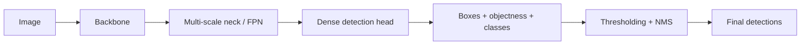

# One Stage Object Detection

Source: `DL_exam.pdf`, Question 23

Original question:

> One-stage object detection. YOLO, SSD, RetinaNet, anchors, anchor-free идеи, trade-off скорости и качества.

## Главная идея

`One-stage object detection` делает dense prediction за один forward pass: сразу предсказывает boxes, objectness/confidence и class scores без отдельного этапа region proposals. Это дает скорость, но создает дисбаланс: почти все позиции/anchors являются фоном.

## Минимум для ответа

- One-stage detector = `backbone` + multi-scale `neck` + dense `head` + NMS.
- В отличие от two-stage, нет стадии proposal generation и повторной классификации каждого proposal.
- `YOLO`: grid/feature positions отвечают за объекты, обычно предсказывают box, objectness и class probabilities; сильная сторона - real-time скорость.
- `SSD`: несколько feature maps и `default boxes` для разных масштабов.
- `RetinaNet`: FPN + две subnet heads; ключевой вклад - `Focal Loss` против foreground/background imbalance.
- `Anchors`: reference boxes разных scales/aspect ratios; модель предсказывает offsets.
- Anchor matching: positive anchors назначают ground truth по IoU, negative anchors считаются фоном, промежуточные могут игнорироваться.
- `Anchor-free`: не задает anchor boxes; предсказывает center heatmap/точки и геометрию box напрямую, например расстояния до сторон.
- Trade-off: one-stage быстрее, но сложнее с маленькими, перекрытыми и редкими объектами; FPN, matching и losses уменьшают разрыв качества.

## Формулы / схема

Общий вид предсказаний:

$$
f_\theta(X) \rightarrow \{(\hat{b}_i,\hat{c}_i,\hat{s}_i)\}_{i=1}^{N}
$$

Score в YOLO-подобной схеме:

$$
s(c)=P(\text{object})P(c\mid \text{object})
$$

Anchor offsets:

$$
t_x=\frac{x-x_a}{w_a},\quad t_y=\frac{y-y_a}{h_a},\quad
t_w=\log\frac{w}{w_a},\quad t_h=\log\frac{h}{h_a}
$$

Focal Loss:

$$
\operatorname{FL}(p_t)=-\alpha_t(1-p_t)^\gamma\log(p_t)
$$

## Диаграмма

## Уточнения экзаменатора

- Зачем anchors? Упрощают regression: сеть уточняет reference box, а не ищет box с нуля.
- Минус anchors? Нужно выбирать sizes, ratios, IoU thresholds; плохие anchors вредят качеству.
- Почему RetinaNet важен? Показал, что one-stage может быть точным при FPN и `Focal Loss`.
- Что делает $\gamma$ в Focal Loss? Чем больше $\gamma$, тем сильнее подавляются легкие примеры.
- Anchor-free без matching? Нет: все равно нужны positive точки/уровни.

## Частые ошибки

- Называть one-stage detector "без post-processing": NMS часто остается обязательным.
- Смешивать objectness и class probability: итоговый score обычно их комбинирует.
- Думать, что anchor-free всегда лучше anchors; преимущество зависит от данных, assignment и training recipe.
- Забывать главную проблему one-stage: огромный class imbalance между фоном и объектами.
