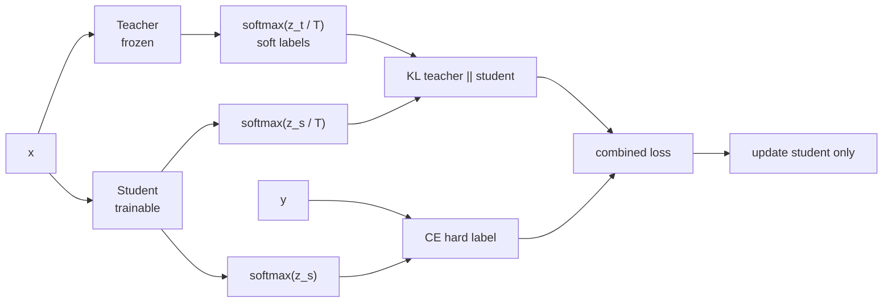

# Knowledge Distillation Basics

Source: `DL_exam.pdf`, Question 24

Original question:

> Knowledge distillation. Teacher-student схема, soft labels, temperature, KL-divergence, зачем нужна дистилляция.

## Главная идея

`Knowledge distillation` переносит поведение сильной модели `teacher` в дешевую модель `student`. Student учится не только по one-hot меткам, но и по распределению вероятностей teacher: оно показывает похожесть классов, уверенность и типичные ошибки.

## Минимум для ответа

- `Teacher` уже обучен и заморожен; `student` меньше, быстрее и обучается на тех же входах.
- `Soft labels` -- вероятности teacher по всем классам, а не только правильный класс (`dark knowledge`).
- `Temperature` $T$ сглаживает `softmax`: при $T > 1$ видны вторичные классы; при $T < 1$ распределение резче.
- Student оптимизируют смесью supervised loss по истинной метке и distillation loss по распределению teacher.
- На inference обычно используют только student и обычный `softmax` с $T = 1$.
- Ограничения: student может копировать ошибки teacher; качество зависит от capacity, данных, $T$ и $\alpha$.

## Формулы / схема

Temperature softmax:

$$
p_i^{(T)} = \frac{\exp(z_i / T)}{\sum_j \exp(z_j / T)}.
$$

KL-divergence в базовой схеме:

$$
\operatorname{KL}(p_t^{(T)} \Vert p_s^{(T)})
= \sum_i p_{t,i}^{(T)} \log \frac{p_{t,i}^{(T)}}{p_{s,i}^{(T)}}.
$$

Типичный objective:

$$
\mathcal{L}
= (1 - \alpha)\operatorname{CE}(y, p_s^{(1)})
+ \alpha T^2 \operatorname{KL}(p_t^{(T)} \Vert p_s^{(T)}).
$$

$T^2$ компенсирует уменьшение масштаба градиентов при большой temperature. Направление KL важно: teacher задает цель, student подгоняется под нее.

## Диаграмма

## Уточнения экзаменатора

- Зачем soft labels? Они передают близость классов и неопределенность teacher.
- Зачем temperature? Чтобы сгладить распределение и раскрыть вторичные классы.
- Почему KL? Это мера расхождения двух распределений вероятностей.
- Что остается после обучения? Только student; teacher нужен для training.
- Может ли student быть лучше teacher? Иногда да из-за регуляризации, но без гарантии.

## Частые ошибки

- Сводить дистилляцию к копированию predicted class.
- Путать роли: teacher заморожен, student обучается.
- Забывать supervised CE и копировать ошибки teacher.
- Считать, что temperature меняет архитектуру, а не softmax при обучении.
- Путать $\operatorname{KL}(p_t \Vert p_s)$ и обратное направление.
