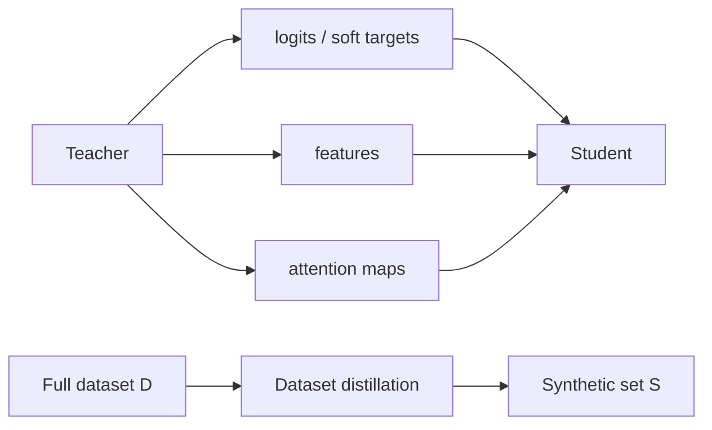

# Distillation Variants and Applications

Source: `DL_exam.pdf`, Question 25

Original question:

> Варианты и применения дистилляции. Дистилляция логитов, признаков и attention, online/offline/self-distillation, dataset distillation.

## Главная идея

`Knowledge distillation` передает student не только hard labels, а поведение teacher: распределения классов, hidden representations, attention или структуру embedding space. Это нужно для compression, ускорения inference, переноса знаний и regularization. `Dataset distillation` отдельно сжимает не модель, а обучающую выборку.

## Минимум для ответа

- `Logit distillation`: student имитирует logits или softened probabilities teacher. Самый архитектурно простой вариант: нужны согласованные выходные классы.
- `Feature distillation`: student копирует промежуточные признаки $h_t^\ell$. Часто нужен projection/adaptor, потому что hidden размерности и слои не совпадают.
- `Attention distillation`: student повторяет attention distributions или spatial importance maps. Полезно для Transformers, detection, segmentation, VLM.
- `Relation distillation`: передаются попарные сходства, расстояния или структура embedding space внутри batch.
- `Offline`: teacher заранее обучен и заморожен; стабильно, но требует teacher.
- `Online`: несколько моделей учатся вместе и обмениваются soft targets; teacher-сигнал меняется, возможна нестабильность.
- `Self-distillation`: teacher получают из той же модели, EMA-копии, предыдущего checkpoint или более глубокого head; часто работает как regularization.
- Применения: mobile/edge deployment, serving latency, сжатие LLM/CV models, transfer между архитектурами, semi-supervised learning, domain adaptation.
- Ограничения: копирование ошибок teacher, несовместимость features, дорогой teacher pass, чувствительность весов loss.

## Формулы / схема

Soft targets с temperature:

$$
p_t^{(T)}=\operatorname{softmax}(z_t/T),\quad
p_s^{(T)}=\operatorname{softmax}(z_s/T)
$$

$$
\mathcal{L}=(1-\alpha)\operatorname{CE}(y,p_s)+\alpha T^2\operatorname{KL}(p_t^{(T)}\Vert p_s^{(T)})
$$

Общий loss:

$$
\mathcal{L}=\lambda_y\mathcal{L}_{sup}+\lambda_z\mathcal{L}_{logits}+\lambda_h\mathcal{L}_{features}+\lambda_a\mathcal{L}_{attention}
$$

Dataset distillation: найти маленький синтетический набор $S$, чтобы обучение на $S$ приближало результат обучения на полном $D$.

## Диаграмма

## Уточнения экзаменатора

- Зачем temperature? Делает distribution мягче и раскрывает межклассовые сходства.
- Почему множитель $T^2$? Компенсирует масштаб градиентов при softmax с temperature.
- Когда feature distillation лучше logits? В задачах со spatial/token structure: segmentation, detection, ASR, LLM.
- Чем self-distillation отличается от offline? Teacher не внешняя большая модель, а версия той же модели.
- Dataset distillation это KD? Родственная идея, но сжимается dataset, а не поведение модели.

## Частые ошибки

- Считать KD только compression, забывая transfer и regularization.
- Путать logits, probabilities и labels.
- Забывать, что feature/attention matching требует сопоставления слоев и размерностей.
- Называть attention полной интерпретацией решения: это лишь один сигнал.
