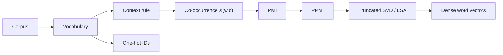

# Word Vector Representations

Source: `DL_exam.pdf`, Question 26

Original question:

> Векторные представления слов. One-hot, distributional hypothesis, count-based embeddings, co-occurrence matrix, PMI/PPMI, LSA.

## Главная идея

Слово как строка нельзя напрямую сравнивать и подавать в численную модель. `Word vector representation` задает отображение слова в вектор. `One-hot` дает только ID слова, а distributional approaches используют корпусную статистику: слова с похожими контекстами получают похожие векторы.

## Минимум для ответа

- Для словаря $V$ one-hot слова $w_i$: $e_i \in \mathbb{R}^{|V|}$, одна координата равна 1.
- Плюс one-hot: простая точная идентификация токена. Минусы: высокая размерность, разреженность, все разные слова ортогональны, нет семантической близости.
- `Distributional hypothesis`: значение слова приближенно задается распределением его контекстов. Это не гарантия синонимии: антонимы и тематически связанные слова тоже могут иметь похожие контексты.
- `Count-based embeddings`: строим word-context co-occurrence matrix $X$, где $X_{w,c}=\#(w,c)$.
- Контекст: окно $\pm k$ слов, документ, предложение, позиционный или syntactic dependency context.
- Raw counts зависят от частотности слов, поэтому используют association measures: PMI/PPMI.
- `LSA` применяет truncated SVD к term-document или word-context matrix и получает dense low-dimensional vectors.

## Формулы / схема

PMI сравнивает совместную встречаемость с независимым ожиданием:

$$
\operatorname{PMI}(w,c)=\log\frac{P(w,c)}{P(w)P(c)}
$$

$$
\operatorname{PPMI}(w,c)=\max(\operatorname{PMI}(w,c),0)
$$

Для LSA:

$$
X \approx U_k\Sigma_k V_k^\top,\qquad z_w=(U_k\Sigma_k)_{w,:}
$$

Близость готовых векторов обычно считают через cosine similarity:

$$
\cos(z_a,z_b)=\frac{z_a^\top z_b}{\|z_a\|_2\|z_b\|_2}
$$

## Диаграмма

## Уточнения экзаменатора

- Почему one-hot не semantic embedding? Разные слова ортогональны: `кошка` не ближе к `собака`, чем к любому другому слову.
- Зачем PMI? Он понижает роль просто частых слов и выделяет информативные ассоциации.
- Зачем PPMI? Отрицательные PMI трудно интерпретировать; PPMI оставляет только положительное evidence.
- Проблема PMI? Редкие случайные пары могут получить завышенный PMI.
- Что делает размер окна? Малое окно ловит функциональную/синтаксическую близость, большое - тематическую.

## Частые ошибки

- Путать co-occurrence matrix и dense embedding после SVD.
- Называть PMI частотой: это нормированная мера ассоциации.
- Забывать, что LSA может работать не только с document matrix, но и с word-context matrix.
- Считать distributional similarity равной синонимии.
