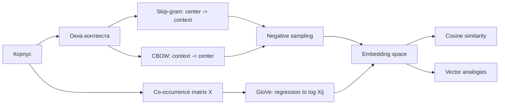

# Word2Vec and GloVe

Source: `DL_exam.pdf`, Question 27

Original question:

> Word2Vec и GloVe. Skip-gram, CBOW, negative sampling, интерпретация embedding space, аналогии и косинусная близость.

## Главная идея

`Word2Vec` и `GloVe` строят dense word embeddings: каждому слову сопоставляется вектор $v_w \in \mathbb{R}^d$, где $d \ll |V|$. Смысл не задается вручную, а восстанавливается из distributional hypothesis: слова с похожими контекстами имеют похожие векторы.

## Минимум для ответа

- `Word2Vec` - predictive подход: учим простую задачу по локальным окнам корпуса, затем берем веса как embeddings.
- `Skip-gram`: центральное слово $w_t$ предсказывает контекст $w_{t+j}$; лучше для редких слов, но дает больше пар.
- `CBOW`: контекст предсказывает центральное слово; быстрее, но усреднение теряет порядок и детали.
- Полный `softmax` дорогой: $O(|V|)$ на пример. `Negative sampling` заменяет его бинарной классификацией реальных и случайных пар.
- `GloVe` - count-based/global подход: использует матрицу совместных встречаемостей $X_{ij}$ и аппроксимирует $\log X_{ij}$.
- Embedding space интерпретируют через nearest neighbors, кластеры, направления и аналогии, но это статистическая геометрия, а не строгая логика смысла.
- Ограничение: static embeddings дают один вектор на слово и плохо различают омонимию. Bias корпуса переносится в векторы.

## Формулы / схема

`Skip-gram`:

$$
\max_\theta \sum_t \sum_{j \ne 0} \log p(w_{t+j}\mid w_t)
$$

`Negative sampling` для положительной пары $(i,o)$:

$$
\mathcal{L}_{i,o}=-\log\sigma(\tilde v_o^\top v_i)-\sum_{k=1}^{K}\log\sigma(-\tilde v_{n_k}^\top v_i)
$$

`CBOW`:

$$
h_t=\frac{1}{|C_t|}\sum_{w\in C_t}v_w,\quad \max \log p(w_t\mid h_t)
$$

`GloVe`:

$$
J=\sum_{i,j} f(X_{ij})(w_i^\top \tilde w_j+b_i+\tilde b_j-\log X_{ij})^2
$$

Cosine similarity:

$$
\cos(u,v)=\frac{u^\top v}{\|u\|\|v\|}
$$

Аналогия: $v_{\text{king}}-v_{\text{man}}+v_{\text{woman}}\approx v_{\text{queen}}$.

## Диаграмма

## Уточнения экзаменатора

- Зачем `negative sampling`? Чтобы не считать softmax по всему словарю; стоимость примерно $O(K)$.
- Чем `GloVe` отличается от `Word2Vec`? `GloVe` явно оптимизирует глобальные counts, `Word2Vec` учится на локальных prediction-примерах.
- Почему cosine, а не dot product? Cosine сравнивает направление и меньше зависит от нормы.
- Почему работают аналогии? Регулярные отношения в корпусе иногда кодируются похожими линейными сдвигами.

## Частые ошибки

- Путать направление `Skip-gram` и `CBOW`.
- Считать embeddings настоящим словарным значением слова.
- Забывать про дороговизну полного softmax.
- Трактовать аналогии как гарантированную алгебру смысла.
- Игнорировать влияние корпуса, токенизации, размера окна, `min_count` и частотных слов.
