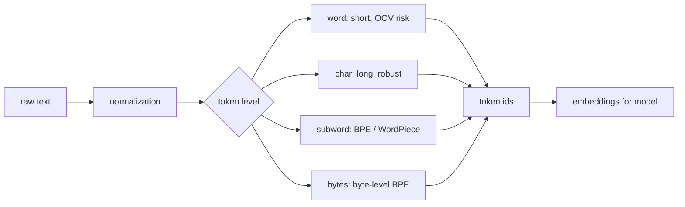

# Text Tokenization

Source: `DL_exam.pdf`, Question 31

Original question:

> Токенизация текста. Word-level, char-level, subword, BPE, WordPiece, byte-level BPE, Unicode/UTF-8.

## Главная идея

Токенизация переводит строку в дискретные токены, затем в ids и embeddings. Она задает "атомы" текста: слова, символы, части слов или байты. Компромисс: крупные токены дают короткие последовательности, но хуже покрывают редкие слова; мелкие почти устраняют `OOV`, но удлиняют контекст и повышают стоимость attention.

## Минимум для ответа

- Формально: $T(s)=(t_1,\dots,t_n)$, $t_i \in V$; далее ids и embeddings $x_i=E[id(t_i)]$.
- `Word-level`: токены примерно слова. Плюсы: короткий input, понятность. Минусы: большой словарь, `OOV`, плохо для морфологии, имен и опечаток.
- `Char-level`: токены - символы/code points. Плюсы: малый словарь, почти нет `OOV`. Минусы: длинные последовательности, модель собирает слова из букв.
- `Subword`: компромисс; частые слова хранятся целиком, редкие раскладываются на части.
- `BPE`: стартует с символов/байтов и жадно объединяет самые частые соседние пары до нужного размера словаря.
- `WordPiece`: похож на BPE, но выбирает элементы по score/likelihood корпуса; при разборе часто использует greedy longest-match, continuation-токены помечаются `##`.
- `byte-level BPE`: сначала UTF-8 bytes, затем BPE; 256 байтов представляют любую корректную Unicode-строку без `[UNK]`.
- Tokenizer является частью pretrained модели: менять normalization, словарь или special tokens нельзя без переобучения/адаптации embeddings.

## Формулы / схема

Pipeline: normalization $\rightarrow$ pre-tokenization $\rightarrow$ segmentation $\rightarrow$ special tokens $\rightarrow$ ids $\rightarrow$ padding/truncation и attention mask.

BPE step:

$$
(a^*,b^*)=\arg\max_{(a,b)} \operatorname{freq}(a,b), \quad c=a^*b^*
$$

UTF-8 для byte-level:

$$
s \xrightarrow{\text{UTF-8}} (b_1,\dots,b_m), \quad b_i \in \{0,\dots,255\}
$$

## Диаграмма

## Уточнения экзаменатора

- Почему subword стал стандартом? Балансирует длину, размер словаря и покрытие редких слов.
- Чем Unicode отличается от UTF-8? Unicode задает code points, UTF-8 кодирует их байтами длины 1-4.
- Почему byte-level BPE почти не имеет `UNK`? Все 256 байтов уже есть в базовом словаре.
- Почему токенизация влияет на цену Transformer? Self-attention стоит примерно $O(n^2)$ по длине sequence.

## Частые ошибки

- Путать byte, Unicode code point и видимый grapheme cluster.
- Считать BPE лингвистическим морфемным анализом: он основан на частотах.
- Менять tokenizer у pretrained модели и ожидать совместимости ids.
- Забывать, что normalization пробелов, регистра и Unicode forms меняет токены.
