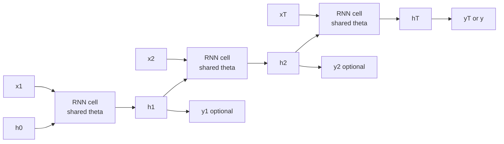

# Recurrent Neural Networks

Source: `DL_exam.pdf`, Question 28

Original question:

> Рекуррентные нейронные сети. Последовательные данные, hidden state, parameter sharing, BPTT, many-to-one/many-to-many задачи.

## Главная идея

`RNN` обрабатывает последовательность по шагам: на входе $x_t$, внутри скрытое состояние $h_t$, то есть сжатая память о префиксе $x_{1:t}$. Один и тот же блок применяется ко всем позициям, поэтому модель работает с разной длиной входа и учит общий закон обновления состояния.

## Минимум для ответа

- Последовательные данные: текст, аудио, временные ряды; важны порядок и зависимости.
- `Hidden state` $h_t$ -- фиксированный вектор памяти, не список прошлых элементов.
- `Parameter sharing`: веса $W_{xh}$, $W_{hh}$, $W_{hy}$ одинаковы для всех $t$; число параметров не растет с длиной $T$.
- `many-to-one`: вся последовательность дает один ответ, например sentiment classification.
- `many-to-many aligned`: ответ на каждом шаге той же длины, например POS-tagging.
- `many-to-many unaligned`: вход и выход разной длины, обычно `seq2seq`.
- Главная проблема простой `RNN`: `vanishing gradients` и `exploding gradients`; помогают `gradient clipping`, `truncated BPTT`, `LSTM`, `GRU`.

## Формулы / схема

Базовая `Elman RNN`:

$$
h_t = \phi(W_{xh}x_t + W_{hh}h_{t-1} + b_h)
$$

$$
\hat{y}_t = g(W_{hy}h_t + b_y)
$$

Для `many-to-one`: $\mathcal{L} = \ell(\hat{y}_T, y)$.  
Для `many-to-many`: $\mathcal{L} = \sum_{t=1}^{T}\ell(\hat{y}_t, y_t)$.

`BPTT` -- `backpropagation` по графу, развернутому во времени. Градиенты по общим весам суммируются по шагам. Дальняя зависимость дает произведение якобианов:

$$
\frac{\partial h_t}{\partial h_k} =
\prod_{i=k+1}^{t}\frac{\partial h_i}{\partial h_{i-1}}
$$

Отсюда исчезновение или взрыв градиента. В `truncated BPTT` градиент останавливают на границе окна $K$, но $h_t$ передают дальше.

## Диаграмма

## Уточнения экзаменатора

- Что хранит $h_t$? Сжатое представление уже прочитанного префикса.
- Чем `RNN` отличается от MLP? Есть связь через $h_{t-1}$ и пошаговая обработка.
- `BPTT` -- это оптимизатор? Нет, это способ вычислить градиенты; обновляет параметры `SGD`, `Adam` и т.п.
- Почему плохо держит длинный контекст? Из-за фиксированного состояния и произведения якобианов.

## Частые ошибки

- Говорить, что на разных шагах разные веса.
- Путать hidden state $h_t$ и предсказание $\hat{y}_t$.
- Забывать различие `many-to-many aligned` и `unaligned`.
- Считать `truncated BPTT` полной обратной связью по всей истории.
