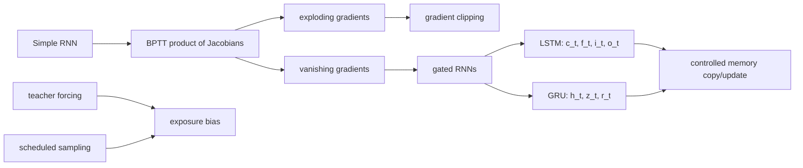

# Gated RNN Architectures

Source: `DL_exam.pdf`, Question 29

Original question:

> Проблемы RNN и gated-архитектуры. Vanishing/exploding gradients, LSTM, GRU, teacher forcing, scheduled sampling.

## Главная идея

Обычная RNN хранит контекст в $h_t$, но при `BPTT` градиент к ранним шагам проходит через произведение якобианов. Поэтому дальний сигнал исчезает или взрывается. LSTM и GRU добавляют `gates`: модель учится копировать, забывать и обновлять память, создавая более прямой путь для информации.

## Минимум для ответа

- Простая RNN: $h_t=\phi(W_xx_t+W_hh_{t-1}+b)$.
- `Vanishing gradients`: нормы производных меньше 1, дальние зависимости плохо учатся.
- `Exploding gradients`: нормы больше 1, loss скачет; практическое лечение - `gradient clipping`.
- LSTM: есть скрытое состояние $h_t$ и отдельная память $c_t$; ворота `forget`, `input`, `output`.
- GRU проще: нет отдельной $c_t$; есть `update gate` $z_t$ и `reset gate` $r_t$.
- LSTM/GRU не гарантируют идеальную память, но облегчают long-range dependencies.
- `Teacher forcing`: декодер на train получает правильный предыдущий токен $y^*_{t-1}$.
- Минус - `exposure bias`: на inference модель видит свои ошибки.
- `Scheduled sampling`: постепенно заменяем часть правильных прошлых токенов на предсказанные моделью.

## Формулы / схема

Градиент через время:
$$
\frac{\partial L_t}{\partial h_k}=
\frac{\partial L_t}{\partial h_t}\prod_{i=k+1}^{t}\frac{\partial h_i}{\partial h_{i-1}}.
$$

LSTM:
$$
c_t=f_t\odot c_{t-1}+i_t\odot \tilde c_t,\quad
h_t=o_t\odot\tanh(c_t).
$$

GRU:
$$
\tilde h_t=\tanh(W_hx_t+U_h(r_t\odot h_{t-1})+b_h),
$$
$$
h_t=(1-z_t)\odot h_{t-1}+z_t\odot\tilde h_t.
$$

Teacher forcing objective:
$$
L(\theta)=-\sum_t\log p_\theta(y_t^*\mid y_{<t}^*,x).
$$

## Диаграмма

Атрибуция: [assets/ATTRIBUTION.md](../assets/ATTRIBUTION.md).

## Уточнения экзаменатора

- Почему исчезает градиент? Перемножаются якобианы переходов; при норме $<1$ получается экспоненциальное затухание.
- Чем LSTM отличается от GRU? LSTM разделяет $c_t$ и $h_t$, GRU хранит все в $h_t$.
- Зачем `forget gate`? Решает, какие координаты старой памяти сохранить.
- Что делает `reset gate`? Управляет прошлым при построении $\tilde h_t$.
- Когда нужен scheduled sampling? В autoregressive seq2seq, чтобы train-time входы были ближе к inference.

## Частые ошибки

- Говорить, что LSTM полностью устраняет `vanishing gradients`.
- Путать $h_t$ и $c_t$ в LSTM.
- Считать `gradient clipping` решением исчезающих градиентов.
- Описывать teacher forcing как регуляризацию, а не режим подачи входов.
- Забывать про `exposure bias` и компромисс scheduled sampling.
