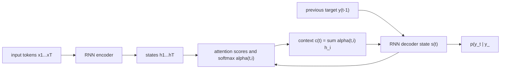

# Seq2Seq and Pre-Transformer Attention

Source: `DL_exam.pdf`, Question 30

Original question:

> Seq2seq и attention до трансформеров. Encoder-decoder, bottleneck одного вектора, attention для машинного перевода.

## Главная идея

`Seq2seq` строит условное распределение для преобразования одной последовательности в другую, например фразы на исходном языке в перевод. До трансформеров это обычно был RNN/LSTM/GRU `encoder-decoder`: encoder читает вход, decoder autoregressive генерирует выход. Ранний вариант сжимал весь вход в один вектор, а attention заменил это динамическим обращением к памяти из всех encoder states.

## Минимум для ответа

- Задача: $p(y_{1:T_y}\mid x_{1:T_x})$, где длины входа и выхода могут отличаться.
- Encoder RNN: читает $x_1,\dots,x_{T_x}$ и строит состояния $h_i$.
- Decoder RNN: генерирует $y_t$ по предыдущим токенам, своему состоянию и контексту.
- Без attention контекст один: $c=h_{T_x}$. Это `bottleneck одного вектора`: фиксированная размерность плохо хранит длинное предложение, порядок, редкие слова и alignment.
- Attention хранит все $h_i$ и на каждом шаге decoder выбирает релевантные позиции через softmax-веса.
- В машинном переводе attention интерпретируют как soft alignment между текущим целевым словом и словами источника.
- Отличие от Transformer: здесь attention добавлен поверх recurrent encoder/decoder; в Transformer attention является основным механизмом обработки последовательности.

## Формулы / схема

Факторизация autoregressive:

$$
p(y_{1:T_y}\mid x)=\prod_{t=1}^{T_y}p(y_t\mid y_{<t},x)
$$

Encoder-decoder без attention:

$$
h_i=f_{\text{enc}}(h_{i-1},E_x(x_i)),\quad c=h_{T_x}
$$

Attention на шаге $t$:

$$
e_{t,i}=\operatorname{score}(s_{t-1},h_i),\quad
\alpha_{t,i}=\operatorname{softmax}_i(e_{t,i}),\quad
c_t=\sum_i\alpha_{t,i}h_i
$$

Обучение: `teacher forcing`, cross-entropy/NLL
$\mathcal{L}=-\sum_t\log p_\theta(y_t^\ast\mid y_{<t}^\ast,x)$; inference: `<bos>` $\rightarrow$ greedy/beam search $\rightarrow$ `<eos>`.

## Диаграмма

## Уточнения экзаменатора

- Почему не хватает одного $c$? Длинный вход сжимается в fixed-size vector, детали и alignment теряются.
- Что такое $\alpha_{t,i}$? Дифференцируемое распределение важности по входным позициям.
- Additive vs dot attention? Additive использует MLP score, dot - скалярное произведение.
- Зачем bidirectional encoder? Чтобы каждый $h_i$ видел левый и правый контекст.
- Что такое teacher forcing? На обучении decoder получает настоящий предыдущий токен.

## Частые ошибки

- Называть pre-transformer attention `self-attention`: это encoder-decoder attention поверх RNN.
- Думать, что attention дает жесткое выравнивание; обычно это soft-веса.
- Забывать autoregressive inference и отличие train/inference.
- Игнорировать маску padding при softmax по входным позициям.
