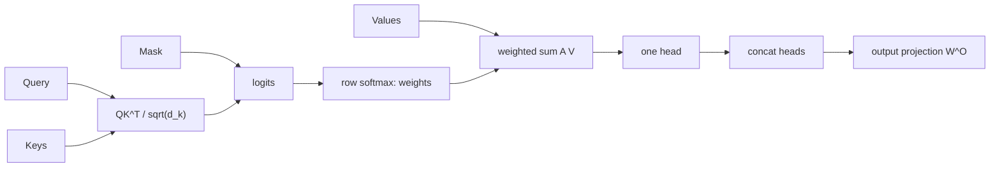

# Attention Mechanism

Source: `DL_exam.pdf`, Question 32

Original question:

> Механизм внимания. Query, Key, Value, scaled dot-product attention, multi-head attention.

## Главная идея

`Attention` для каждой позиции выбирает полезную информацию из других позиций: `Query` говорит, что ищем, `Key` -- по чему сравниваем, `Value` -- что забираем. Результат -- взвешенная сумма `Value`, где веса получены из совместимости `Query` и `Key`.

## Минимум для ответа

- `Query` $q_i$: запрос текущей позиции.
- `Key` $k_j$: "адрес" позиции $j$ для сравнения с запросом.
- `Value` $v_j$: содержимое, которое попадет в выход.
- `Softmax` применяется по keys для каждого query: строка attention matrix суммируется в 1.
- `Self-attention`: $Q,K,V$ из одной последовательности $X$.
- `Cross-attention`: queries из decoder/current states, keys и values из encoder/source states.
- Маски добавляют к logits до `softmax`: `padding mask` запрещает `<pad>`, `causal mask` запрещает будущие токены.
- Без positional information attention не знает порядок токенов.
- Ограничение: self-attention хранит матрицу $n \times n$, память $O(n^2)$, время примерно $O(n^2 d_{\text{model}})$.
- Attention weights полезны для диагностики, но не являются строгим причинным объяснением.

## Формулы / схема

Для $Q \in \mathbb{R}^{n_q \times d_k}$, $K \in \mathbb{R}^{n_k \times d_k}$, $V \in \mathbb{R}^{n_k \times d_v}$:

$$
\operatorname{Attention}(Q,K,V)=
\operatorname{softmax}\left(\frac{QK^\top}{\sqrt{d_k}}+M\right)V
$$

$M_{ij}=0$ для разрешенных связей и большое отрицательное число для запрещенных. Деление на $\sqrt{d_k}$ стабилизирует масштаб logits: без него при большой $d_k$ `softmax` насыщается и градиенты хуже.

`Multi-head attention`:

$$
\operatorname{head}_i=\operatorname{Attention}(QW_i^Q,KW_i^K,VW_i^V)
$$

$$
\operatorname{MHA}(Q,K,V)=\operatorname{Concat}(\operatorname{head}_1,\dots,\operatorname{head}_h)W^O
$$

Обычно $d_k=d_v=d_{\text{model}}/h$.

## Диаграмма

## Уточнения экзаменатора

- Зачем `Value`, если есть `Key`? `Key` нужен для поиска, `Value` -- для передаваемого содержимого.
- Где применяется `softmax`? По keys внутри каждой строки query.
- Почему scaling именно $\sqrt{d_k}$? Дисперсия dot product растет с $d_k$, scaling возвращает logits к стабильному масштабу.
- Зачем multi-head? Разные head'ы учат разные подпространства и типы зависимостей.
- Что делает causal mask? Не дает autoregressive decoder смотреть на будущие токены.

## Частые ошибки

- Делить на $\sqrt{d_{\text{model}}}$ вместо $\sqrt{d_k}$ одного head.
- Путать attention weights $A$ и выход $AV$.
- Считать `Value` вероятностями; вероятностны только веса после `softmax`.
- Забывать positional encoding и causal mask.
- Считать каждый head надежной интерпретацией решения модели.
