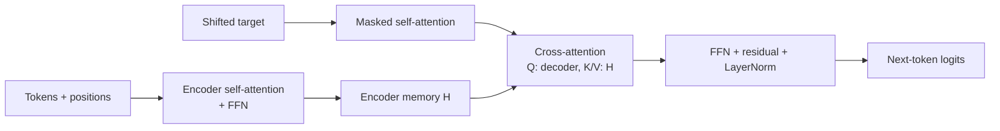

# Transformer Architecture

Source: `DL_exam.pdf`, Question 33

Original question:

> Архитектура Transformer. Self-attention, masked attention, cross-attention, FFN, residual connections, LayerNorm, positional encoding.

## Главная идея

`Transformer` обрабатывает последовательность без recurrence: токен обновляется через `attention` к другим токенам и одинаковый для всех позиций `FFN`. `Self-attention` смешивает позиции, `FFN` преобразует признаки внутри позиции, а positional encoding добавляет порядок, которого в attention нет.

## Минимум для ответа

- Вход: token embeddings + positional encoding: $Z^{(0)}=X+P$.
- Encoder block: `multi-head self-attention` -> residual + `LayerNorm` -> position-wise `FFN` -> residual + `LayerNorm`.
- Decoder block: `masked self-attention` -> residual + `LayerNorm` -> `cross-attention` к encoder memory -> residual + `LayerNorm` -> `FFN` -> residual + `LayerNorm`.
- `Self-attention`: $Q,K,V$ из одной последовательности; padding mask запрещает смотреть на `<pad>`.
- `Masked attention`: causal mask запрещает будущие позиции, чтобы decoder моделировал $p(y_t \mid y_{<t},x)$.
- `Cross-attention`: $Q$ из decoder states, $K,V$ из encoder outputs; это learned soft alignment с source.
- `Residual connections` сохраняют identity path и помогают gradient flow.
- `LayerNorm` нормализует feature dimension внутри одного токена, не batch.
- Типы: encoder-only для понимания текста, decoder-only для autoregressive generation, encoder-decoder для seq2seq.
- Минус: self-attention требует $O(n^2)$ памяти на attention matrix.

## Формулы / схема

$$
\operatorname{Attention}(Q,K,V)=\operatorname{softmax}\left(\frac{QK^\top}{\sqrt{d_k}}+M\right)V
$$

$$
\operatorname{FFN}(x)=W_2\sigma(W_1x+b_1)+b_2
$$

$$
M_{ij}=
\begin{cases}
0, & j \le i,\\
-\infty, & j>i
\end{cases}
$$

Post-norm: $\operatorname{LayerNorm}(x+\operatorname{Sublayer}(x))$. Pre-norm: $x+\operatorname{Sublayer}(\operatorname{LayerNorm}(x))$.

## Диаграмма

Атрибуция: [assets/ATTRIBUTION.md](../assets/ATTRIBUTION.md).

## Уточнения экзаменатора

- Зачем делить на $\sqrt{d_k}$? Чтобы dot products не раздували дисперсию и softmax не насыщался.
- Чем self-attention отличается от cross-attention? В self-attention одна последовательность дает $Q,K,V$; в cross-attention decoder дает $Q$, encoder дает $K,V$.
- Почему нужен causal mask? Он предотвращает утечку будущих target tokens при teacher forcing.
- Что делает positional encoding? Добавляет информацию о порядке или относительном положении токенов.
- Где смешиваются позиции? В attention; `FFN` применяется независимо к каждой позиции.

## Частые ошибки

- Говорить, что Transformer "не учитывает порядок": порядок добавляется явно.
- Забывать padding mask и causal mask.
- Путать `LayerNorm` с `BatchNorm`.
- Считать, что `FFN` делает межпозиционное взаимодействие.
- Не различать encoder-only, decoder-only и encoder-decoder схемы.
