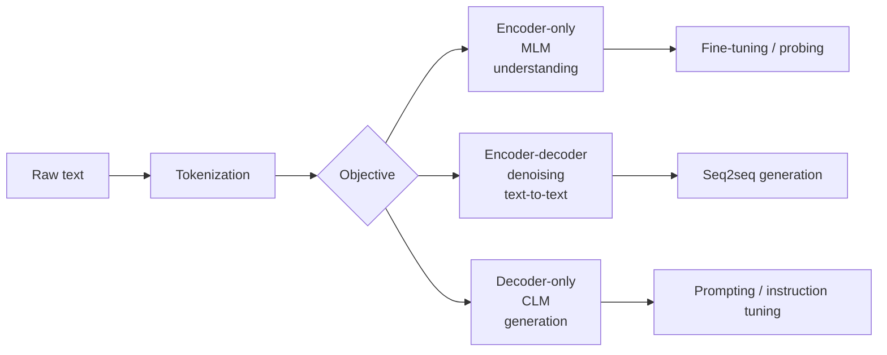

# NLP Pretraining

Source: `DL_exam.pdf`, Question 34

Original question:

> Pretraining в NLP. Зачем нужен self-supervised pretraining, encoder-only, encoder-decoder и decoder-only подходы.

## Главная идея

В NLP много сырого текста и мало дорогой разметки под каждую задачу. `Self-supervised pretraining` строит обучающий сигнал из самого текста: скрыть токены, испортить фрагмент или сдвинуть последовательность и предсказать следующий токен. Модель заранее учит язык, контекстные представления и типичные зависимости, а затем переносит это на downstream-задачи через `fine-tuning`, `prompting`, probing или task head.

## Минимум для ответа

- `Pretraining`: сначала обучаем параметры $\theta$ на большой общей задаче, потом адаптируем к конкретной задаче.
- `Self-supervised` не значит "без loss": метки автоматически получаются из входного текста.
- `Encoder-only` (BERT-like): bidirectional self-attention, сильные contextual embeddings; задачи понимания: classification, NER, semantic similarity, retrieval, reranking, extractive QA. Слабость: генерация слева направо неестественна, есть mismatch из-за `[MASK]`.
- `Encoder-decoder` (T5/BART-like): encoder видит весь вход, decoder авторегрессионно генерирует выход с `cross-attention`; хорош для формата text-to-text: translation, summarization, generative QA, correction. Слабость: тяжелее и медленнее при генерации.
- `Decoder-only` (GPT-like): causal mask, next-token prediction; естественен для generation, chat, code, in-context learning. Слабость: нет полного bidirectional представления текущего токена, генерация последовательная и дорогая.
- Польза pretraining: меньше разметки, лучше обобщение, перенос между задачами, хорошая инициализация, масштабирование с данными/compute.
- Риски: bias корпуса, leakage, hallucinations, доменный mismatch, ограничение context window.

## Формулы / схема

`MLM` для encoder-only:
$$
\mathcal{L}_{MLM}=-\sum_{i\in M}\log p_\theta(x_i\mid \tilde{x})
$$

`CLM` для decoder-only:
$$
\mathcal{L}_{CLM}=-\sum_{t=1}^{T}\log p_\theta(x_t\mid x_{<t})
$$

`Denoising seq2seq`:
$$
\mathcal{L}_{denoise}=-\sum_{t=1}^{T}\log p_\theta(x_t\mid x_{<t}, C(x))
$$

## Диаграмма

## Уточнения экзаменатора

- Чем self-supervised отличается от supervised? В supervised метки внешние, в self-supervised они создаются из данных.
- Почему BERT не GPT? BERT восстанавливает маски по двум сторонам контекста, GPT предсказывает следующий токен только по прошлому.
- Где нужен `cross-attention`? В decoder encoder-decoder модели, чтобы генерировать выход с учетом входа.
- Почему decoder-only стал основой LLM? Objective совпадает с autoregressive inference и хорошо масштабируется.

## Частые ошибки

- Говорить, что self-supervised обучение не имеет целевой функции.
- Путать `MLM` и `CLM`.
- Забывать causal mask в decoder-only.
- Называть encoder-only естественной моделью длинной генерации.
- Считать, что pretraining всегда заменяет downstream adaptation.
