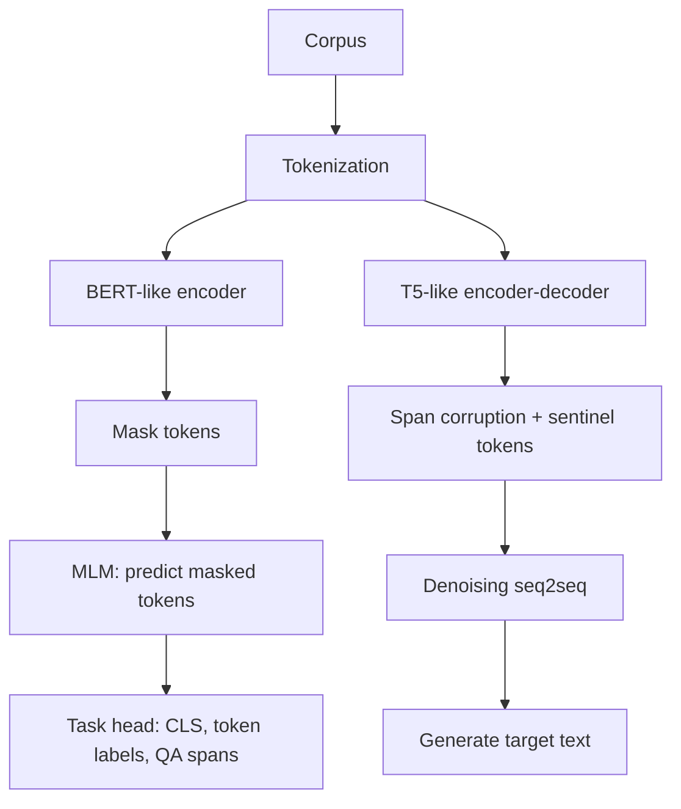

# BERT Like and T5 Like Models

Source: `DL_exam.pdf`, Question 35

Original question:

> BERT-подобные и T5-подобные модели. Masked language modeling, text-to-text постановка, fine-tuning под downstream tasks.

## Главная идея

BERT-like и T5-like модели показывают два способа предобучить Transformer для NLP. BERT учит двунаправленные представления через `masked language modeling`; T5 унифицирует задачи как `text-to-text`, где вход и ответ всегда строки.

## Минимум для ответа

- `BERT-like`: `encoder-only` Transformer, bidirectional `self-attention`, нет causal mask.
- Главная задача pretraining: `MLM`. Выбирают позиции $M$, портят вход $\tilde{x}$, loss считают только по скрытым исходным токенам.
- Downstream: `[CLS]` для classification, hidden states токенов для NER/POS, start/end logits для extractive QA, embeddings для retrieval/reranking.
- Ограничения BERT: не естественная generative LM; есть `[MASK]` mismatch между pretraining и обычным inference.
- `T5-like`: `encoder-decoder` Transformer; encoder читает вход, decoder авторегрессионно генерирует выход через `cross-attention`.
- Главная постановка: любая задача как `input text -> target text`: перевод, summary, QA, classification label.
- T5 pretraining: `denoising` / `span corruption`: spans заменяют sentinel tokens, decoder восстанавливает удаленные фрагменты.
- Fine-tuning: BERT обычно добавляет task head; T5 сохраняет seq2seq loss и генерирует целевую строку.

## Формулы / схема

MLM для BERT:

$$
\mathcal{L}_{MLM}(\theta)=-\sum_{i\in M}\log p_\theta(x_i\mid \tilde{x})
$$

Seq2seq objective для T5:

$$
p_\theta(y\mid x)=\prod_{t=1}^{L}p_\theta(y_t\mid y_{<t},x),\quad
\mathcal{L}=-\sum_{t=1}^{L}\log p_\theta(y_t\mid y_{<t},x)
$$

Практический выбор: BERT чаще берут для понимания текста и классификации; T5 -- когда нужен текстовый выход или единый multitask интерфейс.

## Диаграмма

## Уточнения экзаменатора

- Почему BERT bidirectional? Каждый токен в encoder self-attention видит левый и правый контекст.
- Почему MLM не считается по всем токенам? Иначе модель видела бы правильный токен во входе.
- Как BERT решает QA? Предсказывает распределения по start и end позициям ответа.
- Как T5 делает классификацию? Генерирует label token, например `positive`, вместо отдельной softmax head.
- Чем span corruption отличается от MLM? Удаляются целые фрагменты, а decoder генерирует их как последовательность.

## Частые ошибки

- Называть BERT авторегрессионной моделью.
- Путать `[MASK]` token corruption у BERT и sentinel span corruption у T5.
- Забывать, что T5 inference для классификации тоже является генерацией.
- Считать `text-to-text` архитектурой; это постановка задач, обычно реализованная encoder-decoder моделью.
