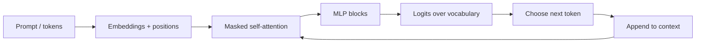

# GPT Like Models

Source: `DL_exam.pdf`, Question 36

Original question:

> GPT-подобные модели. Autoregressive generation, next-token prediction, decoder-only архитектура, in-context learning.

## Главная идея

GPT-like модель учится продолжать текст: по уже увиденным токенам предсказывает следующий. Это `self-supervised` pretraining: target получается сдвигом той же последовательности на один токен. `Decoder-only Transformer` с `causal mask` делает обучение согласованным с генерацией: модель всегда смотрит только влево.

## Минимум для ответа

- Задача: `causal language modeling`, то есть оценка $p_\theta(x_t \mid x_{<t})$.
- Вероятность текста раскладывается autoregressive:
  $$p_\theta(x_1,\dots,x_T)=\prod_{t=1}^{T}p_\theta(x_t\mid x_{<t}).$$
- `Next-token prediction`: вход $x_1,\dots,x_{T-1}$, target $x_2,\dots,x_T$; loss -- cross-entropy/NLL.
- Training: `teacher forcing`, модель видит настоящие предыдущие токены; позиции обучаются параллельно.
- Архитектура: token embeddings + positions + masked self-attention/MLP blocks + residuals + LayerNorm + output softmax.
- `Causal mask` запрещает attention к будущим токенам; без нее модель подглядывала бы в target.
- Generation идет последовательно: prompt -> распределение следующего токена -> decoding -> добавление токена в контекст.
- `In-context learning`: задача задается инструкцией и примерами в prompt, параметры $\theta$ не обновляются.
- Плюсы: масштабируемая цель, естественная генерация, chat/code/QA/summarization через prompting.
- Минусы: медленная генерация, hallucinations, чувствительность к prompt, ограниченное context window, нет bidirectional представления.

## Формулы / схема

Loss для корпуса $D$:
$$
\mathcal{L}(\theta)=-\frac{1}{N}\sum_{x\in D}\sum_{t=1}^{T}\log p_\theta(x_t\mid x_{<t})
$$

Causal attention:
$$
\text{Attention}(Q,K,V)=\text{softmax}\left(\frac{QK^\top}{\sqrt{d_k}}+M\right)V,\quad
M_{ij}=0 \text{ if } j\le i,\; -\infty \text{ if } j>i.
$$

Pipeline: tokenize -> shifted targets -> causal decoder forward -> cross-entropy -> backprop; inference -> iterative decoding with `KV-cache`.

## Диаграмма

Атрибуция: [assets/ATTRIBUTION.md](../assets/ATTRIBUTION.md).

## Уточнения экзаменатора

- Чем GPT отличается от BERT? GPT -- causal decoder-only генератор; BERT -- bidirectional encoder.
- Почему обучение self-supervised? Следующий токен уже есть в тексте, labels не нужны.
- Что такое `teacher forcing`? На training входом служит истинный префикс.
- Что меняется при in-context learning? Только контекст; веса и optimizer не меняются.
- Зачем `KV-cache`? Не пересчитывать keys/values для старого префикса при каждом новом токене.

## Частые ошибки

- Путать `decoder-only` GPT с encoder-decoder Transformer.
- Говорить, что модель "понимает истину": objective учит вероятное продолжение, не проверку фактов.
- Забывать causal mask и проблему подглядывания в future tokens.
- Называть in-context learning обычным fine-tuning.
