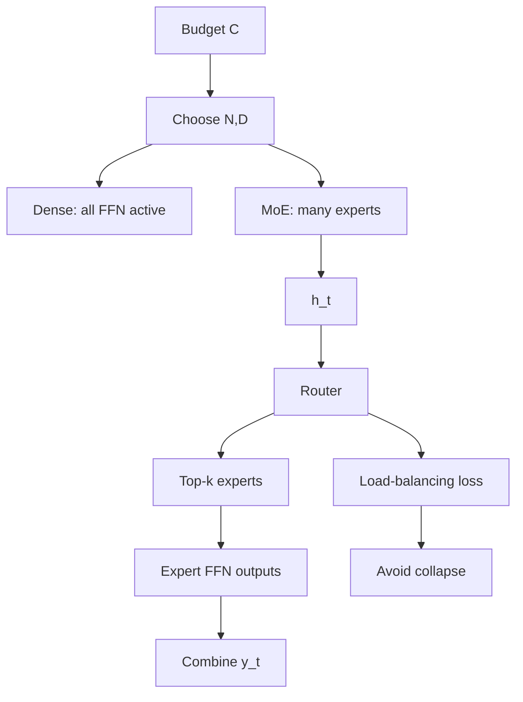

# Transformer Scaling and MoE

Source: `DL_exam.pdf`, Question 37

Original question:

> Масштабирование трансформеров и MoE. Scaling laws, compute/data/model size, sparse experts, router, балансировка экспертов.

## Главная идея

Scaling laws выбирают баланс model size, data и compute: большая модель без данных недообучается, а маленькая не использует корпус. `MoE` увеличивает total parameters через sparse experts: на токен активируется только top-$k$, поэтому capacity растет сильнее, чем active compute.

## Минимум для ответа

- `Scaling laws` -- эмпирические power-law зависимости validation loss от parameters $N$, data tokens $D$ и compute $C$.
- Dense LM часто оценивают как $C \approx 6ND$ FLOPs; это приближение без полной стоимости attention и communication.
- Compute-optimal scaling: при фиксированном $C$ надо совместно увеличивать $N$ и $D$, а не только параметры.
- Data size -- не только количество: важны качество, deduplication, mixture, contamination.
- В dense Transformer почти все параметры активны для каждого токена.
- В `MoE` FFN/SwiGLU заменяют на $E$ expert FFN; router выбирает $k \ll E$ экспертов per token.
- Различать `total parameters` и `active parameters`: MoE велик по памяти, но умерен по FLOPs на токен.
- Риски MoE: expert collapse, dropping, capacity overflow, all-to-all, нестабильный router.

## Формулы / схема

$$
\mathcal{L}(N,D)=\mathcal{L}_\infty+aN^{-\alpha}+bD^{-\beta}
$$

$$
(N^*,D^*)=\arg\min_{N,D}\mathcal{L}(N,D), \quad 6ND \le C
$$

Router:
$$
z_t=W_rh_t,\quad p_t=\operatorname{softmax}(z_t),\quad S_t=\operatorname{TopK}(p_t,k)
$$

MoE output:
$$
y_t=\sum_{i\in S_t} g_{t,i}\operatorname{Expert}_i(h_t)
$$

Load balancing:
$$
\mathcal{L}=\mathcal{L}_{LM}+\lambda E\sum_{i=1}^{E}f_iP_i
$$

где $f_i$ -- доля назначенных токенов, $P_i$ -- средняя probability router.

## Диаграмма

## Уточнения экзаменатора

- Почему scaling laws не теорема? Это эмпирика для конкретных данных, tokenizer, архитектуры и setup.
- Почему нельзя просто увеличить $N$? При фиксированном $C$ уменьшается $D$, модель становится data-limited.
- Что делает capacity factor? Ограничивает токены на эксперта; малый дает dropping, большой -- padding.
- Почему MoE может быть медленным? Routing и all-to-all ухудшают throughput.

## Частые ошибки

- Сравнивать dense и MoE только по total parameters.
- Забывать, что routing обычно per token, а не per sequence.
- Называть MoE бесплатным масштабированием: memory и communication остаются дорогими.
- Не упоминать балансировку экспертов и expert collapse.
- Игнорировать качество данных и quadratic cost attention при длинном контексте.
