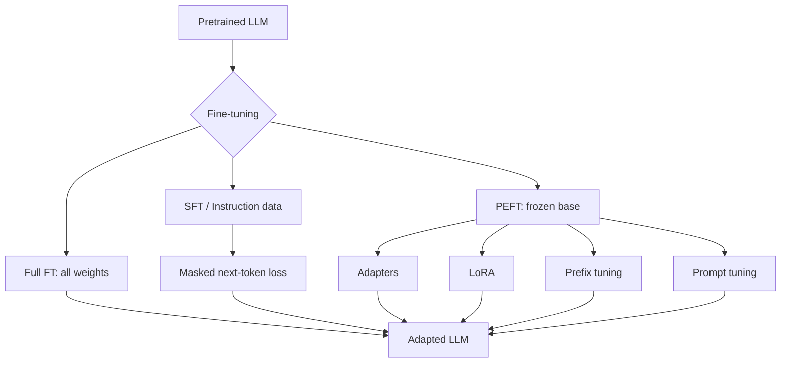

# LLM Fine Tuning

Source: `DL_exam.pdf`, Question 38

Original question:

> Дообучение LLM. Full fine-tuning, supervised fine-tuning, instruction tuning, PEFT, adapters, LoRA, prefix/prompt tuning.

## Главная идея

Fine-tuning адаптирует pretrained LLM к нужному поведению: формату ответа, доменной терминологии, инструкциям, диалогам или узкой задаче. Базовая модель уже знает язык из pretraining, поэтому дообучают все веса или малую обучаемую добавку.

## Минимум для ответа

- `Full fine-tuning`: обновляются все параметры $\theta$. Максимальная гибкость, но высокая память/compute и риск `catastrophic forgetting`.
- `SFT` (`supervised fine-tuning`): обучение на парах `input -> target answer`; для causal LLM это teacher forcing и next-token loss.
- `Instruction tuning`: частный случай SFT на инструкциях/chat-диалогах; учит следовать командам и форматам, не является новой архитектурой.
- `PEFT`: база заморожена, обучается малая часть параметров $\phi$. Дешевле, удобно хранить много адаптаций.
- `Adapters`: bottleneck-модули внутри Transformer layer; добавляют latency, но модульны.
- `LoRA`: low-rank update существующих linear layers; часто первый практический PEFT-бейзлайн.
- `Prompt tuning`: обучаемые soft prompt embeddings на входе.
- `Prefix tuning`: обучаемые prefix vectors, часто дополнительные key/value в attention.

## Формулы / схема

SFT loss по output/assistant-токенам:

$$
\mathcal{L}_{\text{SFT}}=
-\sum_{(x,y)\in D}\sum_t \log p_\theta(y_t\mid x,y_{<t})
$$

С mask для prompt-токенов:

$$
\mathcal{L}= -\frac{1}{\sum_t m_t}\sum_t m_t\log p_\theta(z_t\mid z_{<t})
$$

LoRA для $W\in\mathbb{R}^{d_{out}\times d_{in}}$:

$$
h=Wx+\frac{\alpha}{r}BAx,\quad |\phi|=r(d_{in}+d_{out})
$$

Adapter:

$$
h'=h+W_{up}\sigma(W_{down}h)
$$

## Диаграмма

## Уточнения экзаменатора

- Чем SFT отличается от instruction tuning? SFT - общий supervised objective; instruction tuning - SFT на разнообразных инструкциях и диалогах.
- Почему loss считают только на assistant-токенах? Prompt задан пользователем; цель - генерация ответа.
- Почему full FT опасен? Все веса сдвигаются под узкий датасет, возможны forgetting и деградация общих навыков.
- Можно ли LoRA слить в веса? Да: $W'=W+\frac{\alpha}{r}BA$.
- Когда лучше RAG? Когда нужны актуальные или проверяемые факты.

## Частые ошибки

- Говорить, что fine-tuning гарантированно добавляет знания.
- Путать SFT с RLHF/preference tuning.
- Забывать chat template и loss masking.
- Считать PEFT всегда слабее full FT: на малых данных PEFT может быть лучше.
- Путать hard prompt с soft prompt.
