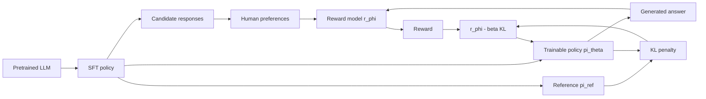

# Preference Tuning and RLHF

Source: `DL_exam.pdf`, Question 39

Original question:

> Preference tuning и RLHF. Reward model, человеческие предпочтения, отличие RLHF от SFT, роль KL-регуляризации.

## Главная идея

`SFT` учит LLM имитировать демонстрации, но не всегда оптимизирует то, что человек реально предпочтет: полезность, безопасность, полноту, стиль. `Preference tuning` использует сравнения ответов. `RLHF` превращает предпочтения в learned reward и дообучает LLM как policy, ограничивая отклонение от SFT-модели через KL-регуляризацию.

## Минимум для ответа

- `Preference tuning`: адаптация модели по сигналу "ответ $y^+$ лучше, чем $y^-$", а не только по одному эталонному ответу.
- Pipeline RLHF: pretrained LLM -> `SFT` -> pairwise/ranking preferences -> `reward model` -> RL-оптимизация policy.
- `Reward model` $r_\phi(x,y)$ выдает скалярную оценку ответа на prompt $x$; это proxy человеческой полезности, а не истина.
- Отличие: SFT минимизирует `cross-entropy` на demonstrations $(x,y^*)$, RLHF максимизирует learned reward.
- Риски: шумная разметка, bias annotators, reward hacking, нестабильность RL.
- `KL penalty` удерживает новую policy около reference policy $\pi_{ref}$, обычно SFT-модели.

## Формулы / схема

Reward model часто обучают через Bradley-Terry loss:

$$
P(y^+ \succ y^- \mid x)=\sigma(r_\phi(x,y^+)-r_\phi(x,y^-))
$$

$$
\mathcal{L}_{RM}=-\mathbb{E}\log\sigma(r_\phi(x,y^+)-r_\phi(x,y^-)).
$$

SFT:

$$
\mathcal{L}_{SFT}=-\mathbb{E}_{(x,y^*)}\sum_t \log \pi_\theta(y_t^* \mid x,y^*_{<t}).
$$

KL-regularized RLHF:

$$
\max_\theta \mathbb{E}_{x, y \sim \pi_\theta}[r_\phi(x,y)-\beta D_{KL}(\pi_\theta(\cdot \mid x)\Vert \pi_{ref}(\cdot \mid x))].
$$

Малый $\beta$ усиливает reward hacking; большой $\beta$ почти блокирует улучшение.

## Диаграмма

## Уточнения экзаменатора

- Зачем preferences? Часто легче выбрать лучший ответ, чем написать идеальный.
- Почему reward по разности? Pairwise label задает относительный порядок, поэтому важна $r(x,y^+)-r(x,y^-)$.
- Почему не только reranking? Reranking выбирает из samples, RLHF меняет саму policy.
- Что такое reward hacking? Высокий learned reward при плохом реальном качестве.
- Чем DPO отличается от RLHF? DPO оптимизирует policy напрямую по preference pairs, без отдельного online RL-шага.

## Частые ошибки

- Считать RLHF тем же самым, что SFT на "правильных" ответах.
- Интерпретировать reward как вероятность истинности.
- Забывать KL-регуляризацию и знак штрафа: максимизируют $r-\beta KL$.
- Путать `preference tuning` как общий класс и `RLHF` как конкретный pipeline.
