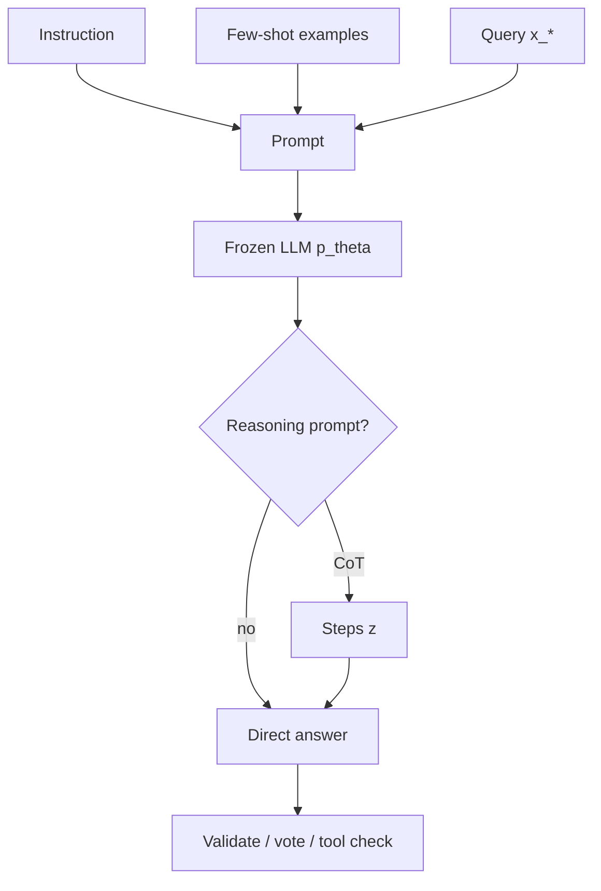

# In Context Learning and Prompting

Source: `DL_exam.pdf`, Question 40

Original question:

> In-context learning, prompting и Chain-of-Thought. Few-shot prompting, reasoning prompts, ограничения промптового подхода.

## Главная идея

`In-context learning` (`ICL`) - адаптация LLM на этапе inference: модель получает инструкцию, примеры и запрос в prompt и меняет поведение только через условное распределение. Веса $\theta$ не обновляются, поэтому это не `fine-tuning`, а использование контекста как временного описания задачи.

## Минимум для ответа

- `Prompting`: текстово задает задачу, данные, формат ответа, ограничения и критерии качества.
- `Zero-shot`: только инструкция; дешево, но много неоднозначности.
- `Few-shot`: $k$ демонстраций $(x_i,y_i)$ задают label space, стиль, формат и decision boundary.
- `Chain-of-Thought` (`CoT`): prompt стимулирует промежуточные шаги $z$ перед ответом $y$; полезно для математики, логики, планирования.
- `Reasoning prompts`: CoT, decomposition, least-to-most, self-consistency, ReAct-подобные схемы.
- Ограничения: чувствительность к формулировке и порядку примеров, `context window`, отсутствие постоянного обучения, hallucinations, prompt injection, стоимость длинного prompt, нестабильные рассуждения.
- Prompting часто комбинируют с `RAG`, tools, constrained decoding и fine-tuning.

## Формулы / схема

Для autoregressive LLM:

$$
p_\theta(y \mid c,x)=\prod_{t=1}^{T}p_\theta(y_t \mid c,x,y_{<t})
$$

где $c$ - инструкция, few-shot examples, ограничения и история. В ICL:

$$
\theta_{\text{after}}=\theta_{\text{before}}
$$

Few-shot prompt:

$$
c=[\text{instruction};(x_1,y_1);\ldots;(x_k,y_k);x_*]
$$

Self-consistency:

$$
(z_j,y_j)\sim p_\theta(z,y\mid c),\quad \hat y=\arg\max_y\sum_{j=1}^{m}\mathbf{1}[y_j=y]
$$

Цена растет примерно как $m\cdot(|c|+|z|+|y|)$.

## Диаграмма

## Уточнения экзаменатора

- Чем ICL отличается от fine-tuning? В ICL нет градиентного обновления весов; меняется только входной контекст.
- Почему few-shot помогает? Примеры показывают шаблон, метки, формат и пограничные случаи.
- Гарантирует ли CoT правильность? Нет, цепочка может быть post-hoc и ошибочной.
- Что такое self-consistency? Сэмплировать несколько reasoning paths и выбрать устойчивый ответ.
- Когда нужен RAG? Когда ответ зависит от точных внешних или свежих фактов.

## Частые ошибки

- Говорить, что модель "дообучается" при ICL.
- Путать ручной `prompting` и `prompt tuning`, где обучаются soft prompt embeddings.
- Считать, что больше few-shot examples всегда лучше: они могут добавить шум и вытеснить контекст.
- Игнорировать label bias и порядок примеров.
- Принимать CoT за доказательство корректности без проверки.
- Использовать prompting вместо источников, tools или валидации для критичных фактов.
