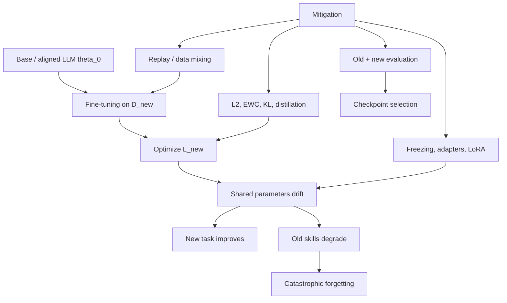

# Catastrophic Forgetting

Source: `DL_exam.pdf`, Question 41

Original question:

> Catastrophic forgetting при дообучении. Почему возникает, чем опасен, какие общие способы смягчения используются.

## Главная идея

`Catastrophic forgetting` -- резкая деградация старых навыков после `fine-tuning` на новой задаче или домене. LLM хранит язык, факты, reasoning, code и safety behavior в общих параметрах; если loss видит только новые данные, градиенты могут улучшить новую цель и разрушить старые решения.

## Минимум для ответа

- Формально: дообучение минимизирует $L_{\text{new}}(\theta)$ и обычно не контролирует $L_{\text{old}}(\theta)$.
- Причины: общие параметры, `distribution shift`, отсутствие старых данных, конфликт градиентов, узкий датасет, большой `learning rate`, много эпох, смена objective при `SFT` или `RLHF`.
- Опасность для LLM: лучше в узком формате, но хуже в общих знаниях, многоязычности, coding, инструкциях, factuality и safety.
- Ключевой компромисс: `plasticity` учит новое, `stability` сохраняет старое; сильная plasticity повышает риск forgetting.
- Диагностика: сравнивать baseline $\theta_0$ и checkpoints на old+new benchmarks.
- Смягчение: replay, регуляризация к $\theta_0$, `EWC`, distillation/KL к reference model, freezing, adapters, `LoRA`, малый `learning rate`, `early stopping`.

## Формулы / схема

Обычный fine-tuning:

$$
\theta^*=\arg\min_\theta L_{\text{new}}(\theta),
\qquad
L_{\text{old}}(\theta^*) \text{ может вырасти.}
$$

Смесь с replay:

$$
L(\theta)=\lambda L_{\text{new}}(\theta)+(1-\lambda)L_{\text{replay}}(\theta).
$$

Штраф ухода от исходной модели:

$$
L(\theta)=L_{\text{new}}(\theta)+\lambda\lVert\theta-\theta_0\rVert_2^2.
$$

`EWC` штрафует важные параметры сильнее:

$$
L(\theta)=L_{\text{new}}(\theta)+\frac{\lambda}{2}\sum_i F_i(\theta_i-\theta_{0,i})^2.
$$

## Диаграмма

## Уточнения экзаменатора

- Чем отличается от overfitting? `Overfitting` -- плохое обобщение на текущем распределении; forgetting -- потеря старых задач.
- Почему replay помогает? Возвращает старые навыки в objective, поэтому loss штрафует их деградацию.
- Что делает `EWC`? Оценивает важность параметров и сильнее ограничивает важные веса.
- Зачем KL к reference model? Чтобы новая policy не уходила далеко от исходной aligned модели.
- Гарантирует ли `LoRA` отсутствие forgetting? Нет, только снижает риск, потому что базовые веса почти не меняются.

## Частые ошибки

- Проверять только новый датасет и не иметь old regression suite.
- Называть forgetting просто переобучением.
- Забывать про деградацию alignment и safety.
- Считать freezing/PEFT полным решением.
- Не фиксировать baseline $\theta_0$ перед дообучением.
