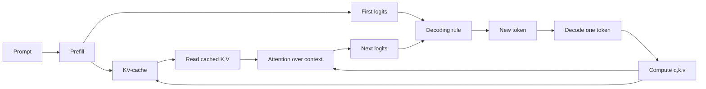

# LLM Inference

Source: `DL_exam.pdf`, Question 42

Original question:

> Инференс LLM. Training vs inference, autoregressive generation, latency, KV-cache, почему генерация дорогая.

## Главная идея

Инференс LLM - это работа обученной модели: веса фиксированы, gradients и optimizer не нужны, модель много раз предсказывает следующий токен. Для decoder-only LLM ответ строится autoregressive, поэтому генерация дорогая: каждый новый токен зависит от уже выбранных и требует прохода через всю модель.

## Минимум для ответа

- `Training`: minimize loss, teacher forcing, backpropagation, обновление весов, большой параллелизм по позициям.
- `Inference`: только forward pass, состояние запроса: prompt, generated tokens, decoding parameters, KV-cache.
- Фазы: `prefill` обрабатывает prompt параллельно и строит KV-cache; `decode` добавляет по одному output-токену.
- `Latency`: `TTFT` - время до первого токена; `TPOT` - среднее время на следующий; total latency зависит от prompt и output length.
- KV-cache хранит `key` и `value` прошлых позиций во всех слоях: меньше recompute, больше memory и cache reads.
- Почему дорого: последовательный decode, большие веса, растущий контекст, memory bandwidth, KV-cache, batching trade-off.

## Формулы / схема

Autoregressive factorization:

$$p_\theta(y_{1:m}\mid x)=\prod_{t=1}^{m}p_\theta(y_t\mid x,y_{<t}).$$

Оценка latency:

$$\text{Total latency}\approx \text{TTFT}+(m-1)\cdot \text{TPOT}.$$

KV-cache memory:

$$\text{KV memory}\approx B\cdot L\cdot 2\cdot H_{kv}\cdot T\cdot d_{head}\cdot s.$$

Decode step: последний токен -> новые $q_t,k_t,v_t$ -> attention к cached $K,V$ -> выбор токена -> append $k_t,v_t$.

## Диаграмма

## Уточнения экзаменатора

- **Почему training параллельнее?** При teacher forcing правильные токены известны, loss по позициям считается параллельно.
- **Что дает KV-cache?** Не пересчитывать old keys/values; ускоряет decode ценой памяти $O(BLTd)$.
- **Почему cache не делает decode бесплатным?** Новый query все равно читает растущий cache и проходит все layers.
- **Что ухудшает TTFT?** Длинный prompt, очередь/scheduling, большой prefill.
- **Что ухудшает TPOT?** Большая модель, длинный context, малая загрузка GPU, медленная память.

## Частые ошибки

- Думать, что LLM генерирует весь ответ одним forward pass.
- Путать KV-cache с activations для backward pass.
- Забывать, что batching повышает throughput, но может ухудшать latency.
- Считать KV-cache только compute-оптимизацией, игнорируя memory cost.
