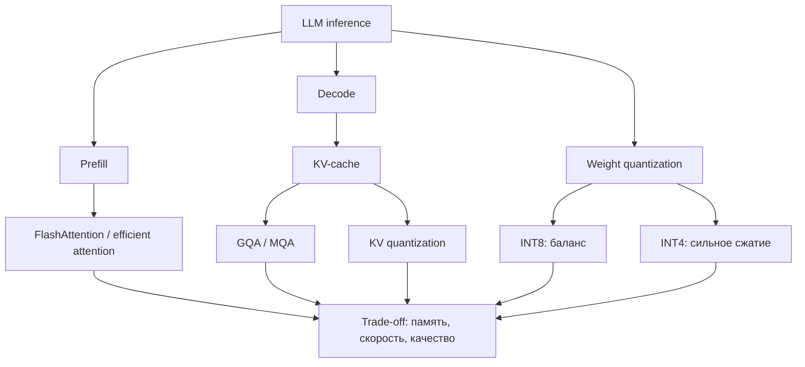

# Efficient LLM Inference

Source: `DL_exam.pdf`, Question 43

Original question:

> Ускорение и сжатие LLM на инференсе. Efficient attention, квантизация INT8/INT4, trade-off памяти, скорости и качества.

## Главная идея

Инференс LLM дорог из-за autoregressive generation: `prefill` обрабатывает prompt, а `decode` добавляет токены последовательно. Ускорение ищут в attention, `KV-cache` и хранении весов. Компромисс: меньше память и выше throughput против потери качества, overhead dequantization и зависимости от kernels.

## Минимум для ответа

- `prefill` параллелен по prompt и дорог по attention; `decode` идет по одному токену и часто упирается в memory bandwidth.
- `KV-cache` хранит $K,V$ прошлых токенов: меньше пересчетов, но больше памяти.
- Dense self-attention: compute $O(n^2 d)$, attention matrix $O(n^2)$.
- `FlashAttention` -- exact attention: блочный IO-aware softmax без полной матрицы $n \times n$.
- Sparse/window/linear attention меняют структуру attention и могут ограничивать дальний контекст.
- `MQA/GQA`: меньше KV-heads, меньше `KV-cache` и bandwidth на decode.
- INT8/INT4: FP16 = 2 байта, INT8 = 1 байт, INT4 = 0.5 байта на число без metadata.
- INT8 стабильнее; INT4 сильнее сжимает, но чувствительнее к outliers, calibration и group size.
- Варианты: weight-only quantization, weight+activation quantization, `KV-cache` quantization, PTQ, QAT.

## Формулы / схема

Attention:

$$
\mathrm{Attn}(Q,K,V)=\mathrm{softmax}\left(\frac{QK^\top}{\sqrt{d_h}}\right)V
$$

Память `KV-cache`:

$$
\mathrm{Mem}_{KV}\approx 2L B n h_{kv} d_h s
$$

Память весов:

$$
\mathrm{Mem}_{weights}\approx N\frac{b}{8}
$$

Affine quantization:

$$
x_q=\mathrm{clip}\left(\mathrm{round}\left(\frac{x}{s}\right)+z,q_{\min},q_{\max}\right), \quad \hat{x}=s(x_q-z)
$$

## Диаграмма

## Уточнения экзаменатора

- Почему `KV-cache` ускоряет decode? Не пересчитываются $K,V$ прошлых токенов.
- Почему cache дорог? Размер растет по $L,B,n,h_{kv},d_h$.
- `FlashAttention` exact? Да, для dense attention он меняет реализацию, а не результат.
- Когда INT4 хуже INT8? При плохих kernels, больших outliers, слабой calibration, сложных reasoning-задачах.
- Что дает `GQA`? Компромисс между качеством full MHA и памятью `MQA`.

## Частые ошибки

- Говорить, что `FlashAttention` делает dense attention линейным по $n$.
- Считать, что квантизация всегда ускоряет: нужна поддержка hardware и эффективный kernel.
- Забывать про scales, zero-points и metadata.
- Путать сжатие весов с квантизацией активаций и `KV-cache`.
- Оценивать только веса, игнорируя `KV-cache` при long context и batch serving.
