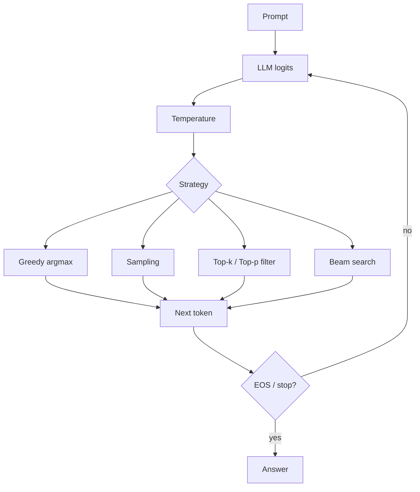

# LLM Decoding

Source: `DL_exam.pdf`, Question 44

Original question:

> Декодирование LLM. Greedy decoding, sampling, temperature, top-k/top-p, beam search, связь стратегии декодирования с качеством ответа.

## Главная идея

LLM на каждом шаге выдает распределение по следующему токену $p_\theta(x_t \mid x_{<t})$, а decoding превращает его в текст. Стратегия не меняет знания модели, но меняет стабильность, diversity, риск ошибок и формат.

## Минимум для ответа

- `Greedy decoding`: выбрать самый вероятный токен. Быстро, детерминированно, удобно для JSON и factual answers; минус - локальный argmax и шаблонность.
- `Sampling`: сэмплировать токен из распределения. Дает diversity; минус - выше риск incoherence и hallucinations.
- `Temperature`: масштабирует logits перед `softmax`. $T<1$ заостряет распределение, $T>1$ делает его более плоским.
- `Top-k`: оставить $k$ самых вероятных токенов, занулить хвост, перенормировать и сэмплировать.
- `Top-p` / nucleus: оставить минимальное множество токенов с суммарной вероятностью хотя бы $p$; адаптивнее top-k.
- `Beam search`: хранит $B$ лучших гипотез. Полезен в переводе, но в open-ended LLM часто дает generic/repetitive ответы.
- Качество зависит от задачи: точность и формат требуют низкой случайности; творческие задачи - контролируемого sampling.

## Формулы / схема

$$
p_\theta(x_{1:T})=\prod_{t=1}^{T}p_\theta(x_t\mid x_{<t})
$$

$$
x_t=\arg\max_i p_\theta(i\mid x_{<t})
$$

$$
p_T(i)=\frac{\exp(z_i/T)}{\sum_{j\in V}\exp(z_j/T)}
$$

Для beam search:

$$
s(x_{1:t})=\sum_{\tau=1}^{t}\log p_\theta(x_\tau\mid x_{<\tau})
$$

Pipeline: prompt -> logits -> temperature -> top-k/top-p -> `softmax` -> argmax/sample -> stop при `EOS`, stop sequence или `max tokens`.

## Диаграмма

## Уточнения экзаменатора

- Почему greedy не глобально оптимален? Он выбирает локально лучший токен, не перебирая продолжения.
- Чем top-k отличается от top-p? Top-k фиксирует число токенов, top-p - probability mass.
- Что делает низкая temperature? Увеличивает разрывы logits и приближает выбор к argmax.
- Зачем length penalty в beam search? Сумма log probabilities штрафует длинные ответы.
- Можно ли совмещать temperature и top-p? Да: сначала temperature, затем фильтрация и sampling.

## Частые ошибки

- Говорить, что decoding обучает или исправляет модель.
- Забывать перенормировку после top-k/top-p.
- Считать beam search универсально лучшим.
- Путать `temperature=0` с обычным sampling.
- Оценивать качество только likelihood, игнорируя factuality, формат, повторы, latency и stop conditions.
