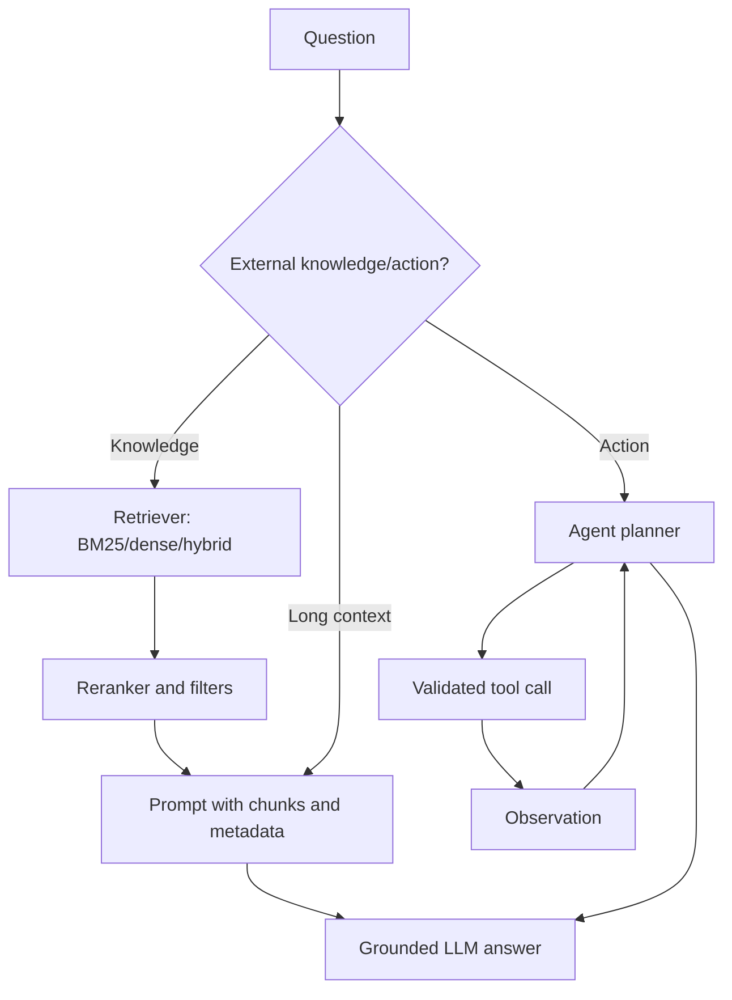

# RAG Long Context and Agents

Source: `DL_exam.pdf`, Question 45

Original question:

> RAG, длинный контекст и агенты. Как добавлять внешнее знание без переобучения, retrieval, tools, ограничения агентных схем.

## Главная идея

LLM можно расширять без изменения весов: факты ищутся во внешнем корпусе, а действия выполняются через tools. RAG дает grounded answer, long context кладет больше текста сразу, agents организуют цикл действий. Цена: ошибки retrieval, шум, prompt injection, latency/cost и отсутствие гарантий.

## Минимум для ответа

- RAG: `query -> retrieval -> context construction -> generation`; веса $p_\theta$ фиксированы, обновляются база и индекс.
- Offline: ingest, chunking, metadata, embeddings/BM25, индекс. Online: query rewrite, top-$k$ retrieval, reranking, prompt assembly, grounded generation.
- Retrieval: sparse/BM25 хорош для точных терминов; dense embeddings ловят смысл; hybrid совмещает; reranker повышает precision top-$k$.
- Long context полезен для большого документа, но дороже по prefill, KV-cache, attention; возможен `lost in the middle`.
- Tools: search, SQL, calculator, code interpreter, API. Вызовы structured, валидируемые и ограниченные правами.
- Agent: LLM + state/memory + tools + loop `plan/act/observe/revise`; нужны step limit, sandboxing, logging, approval для side effects.

## Формулы / схема

RAG можно представить как условную генерацию по найденным документам:

$$p(y \mid x) \approx \sum_{d \in \mathcal{D}_k(x)} p_\eta(d \mid x)p_\theta(y \mid x,d).$$

Dense retrieval:

$$q=g_\phi(x),\quad e_i=g_\phi(d_i),\quad s_i=q^\top e_i.$$

Схема: retriever берет top-$N$, reranker оставляет top-$k$, generator отвечает по evidence и metadata.

## Диаграмма

## Уточнения экзаменатора

- RAG vs fine-tuning? RAG меняет context, fine-tuning меняет веса; RAG лучше для свежих фактов, fine-tuning для поведения.
- Почему BM25 иногда лучше dense? Точные имена, коды ошибок и редкие термины важнее semantic similarity.
- Если ничего не найдено? Сказать, что evidence недостаточно, переформулировать query или уточнить вопрос.
- Почему agents ненадежны? Ошибки tool choice, аргументов и observations накапливаются.

## Частые ошибки

- Говорить, что RAG "обучает" модель на документах.
- Путать наличие документа в базе с его попаданием в context.
- Считать long context бесплатной заменой retrieval.
- Доверять retrieved text как инструкции: это untrusted input.
- Разрешать tools без schema validation, permissions и подтверждения опасных действий.
