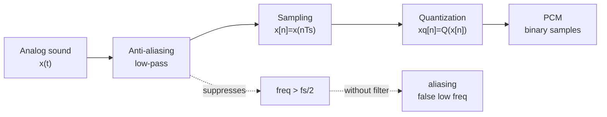

# Audio Signals Sampling and PCM

Source: `DL_exam.pdf`, Question 46

Original question:

> Звук как сигнал. Waveform, sampling, quantization, PCM, теорема Найквиста-Шеннона, aliasing.

## Главная идея

Звук - непрерывный сигнал во времени: амплитуда давления/напряжения $x(t)$. Компьютер хранит числа, поэтому аудио оцифровывают: берут отсчеты (`sampling`), округляют амплитуду (`quantization`) и записывают уровни битами в `PCM`. Главный риск sampling - `aliasing`: высокие частоты становятся неотличимы от низких.

## Минимум для ответа

- `Waveform` - форма сигнала во времени: $x(t)$ или $x[n]$.
- `Sampling` дискретизирует время; `quantization` дискретизирует амплитуду.
- `PCM` (`Pulse Code Modulation`) - несжатое кодирование отсчетов; параметры: sample rate, bit depth, channels.
- Найквист-Шеннон: band-limited сигнал с максимумом $B$ Гц можно восстановить при $f_s > 2B$ в идеальных условиях; $f_N = f_s/2$.
- Перед АЦП нужен analog `anti-aliasing low-pass filter`, подавляющий частоты выше $f_s/2$.
- Bit depth уменьшает quantization noise, sample rate задает верхнюю представимую частоту.
- `Clipping` - обрезание амплитуды за диапазоном; нормализация потом не восстанавливает потерю.

## Формулы / схема

$$
x[n] = x(nT_s), \quad T_s = \frac{1}{f_s}
$$

$$
f_s > 2B, \quad f_N = \frac{f_s}{2}
$$

$$
L = 2^b, \quad e[n] = x_q[n] - x[n], \quad |e[n]| \le \frac{\Delta}{2}
$$

$$
\mathrm{Var}(e) \approx \frac{\Delta^2}{12}, \quad R = f_s \cdot b \cdot C
$$

Alias-частота: $f_{\text{alias}} = |f - kf_s|$, где $f_{\text{alias}} \in [0, f_s/2]$.

## Диаграмма

## Уточнения экзаменатора

- Почему 44.1 kHz? $f_N = 22.05$ kHz покрывает слышимый диапазон около 20 kHz.
- Чем sampling отличается от quantization? Первое дискретизирует время, второе - амплитуду.
- Можно ли убрать aliasing после записи? Надежно нет: частоты уже смешались.
- Что дает больший bit depth? Меньше шум квантования, но не выше частотная полоса.
- Что дает больший sample rate? Выше $f_N$, но не меньше ошибка квантования.

## Частые ошибки

- Путать sample rate и частоту Найквиста.
- Забывать условия теоремы: band-limited сигнал, равномерный sampling, идеальная фильтрация/interpolation.
- Считать, что цифровой low-pass после sampling исправит aliasing.
- Смешивать quantization noise с aliasing.
- Называть PCM сжатием или забывать множитель каналов $C$ в битрейте.
