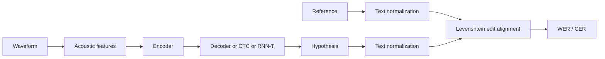

# Automatic Speech Recognition Task and Metrics

Source: `DL_exam.pdf`, Question 48

Original question:

> Automatic Speech Recognition. Постановка STT-задачи, уровни токенизации, WER/CER, alignment problem.

## Главная идея

`ASR` (`Automatic Speech Recognition`) или `STT` переводит речь в дискретный текст. Вход - длинная последовательность аудио-фреймов $X=(x_1,\dots,x_T)$, выход - токены $Y=(y_1,\dots,y_U)$, обычно $T \gg U$. Главная трудность: неизвестно, какие фреймы соответствуют словам, символам или subword-токенам.

## Минимум для ответа

- Формальная задача: найти наиболее вероятную транскрипцию по акустическим признакам.
- Pipeline: waveform $\rightarrow$ features (`log-mel`, MFCC) $\rightarrow$ acoustic encoder $\rightarrow$ decoder/LM $\rightarrow$ transcript.
- Выходная токенизация:
  - `phoneme`: ближе к произношению, но нужен pronunciation lexicon;
  - `character`/grapheme: маленький словарь, нет OOV, но длинный output;
  - `subword` (`BPE`, unigram): практический компромисс;
  - `word`: короткий output, но огромный словарь и OOV.
- `Alignment problem`: при обучении дана пара `(audio, transcript)`, но нет frame-level labels.
- Решения: `CTC` суммирует вероятности по всем монотонным alignment; attention decoder учит мягкое соответствие; `RNN-T` моделирует движение по времени и по выходу.
- Метрики считают edit alignment между reference и hypothesis, а не акустические границы.

## Формулы / схема

$$
\hat{Y}=\arg\max_Y P_\theta(Y\mid X)
$$

С внешней language model:

$$
\hat{Y}=\arg\max_Y[\log P_{\text{AM}}(Y\mid X)+\lambda\log P_{\text{LM}}(Y)+\beta |Y|]
$$

`WER`:

$$
\operatorname{WER}=\frac{S+D+I}{N_{\text{word, ref}}}
$$

`CER`:

$$
\operatorname{CER}=\frac{S_{\text{char}}+D_{\text{char}}+I_{\text{char}}}{N_{\text{char, ref}}}
$$

Где $S$ - substitutions, $D$ - deletions, $I$ - insertions. WER может быть больше $1$ из-за вставок. Перед подсчетом нужна одинаковая text normalization: регистр, пунктуация, числа, пробелы.

## Диаграмма

## Уточнения экзаменатора

- Почему $T \gg U$? Аудио разбито на частые короткие фреймы, а текст содержит меньше токенов.
- Чем WER отличается от accuracy? Это нормированный edit distance; он не обязан быть в $[0,1]$.
- Когда CER полезнее WER? Для коротких строк, имен, кодов, языков без явных пробелов.
- Что такое insertion? Лишний токен в hypothesis относительно reference.
- Может ли модель предсказывать subwords, а оцениваться WER? Да, после detokenization сравнивают слова.

## Частые ошибки

- Смешивать acoustic alignment при обучении и edit alignment для WER/CER.
- Делить WER на длину hypothesis, а не reference.
- Забывать вставки $I$.
- Считать, что word-level output обязателен для WER.
- Описывать CTC как выбор одного alignment, а не суммирование по допустимым alignment.
