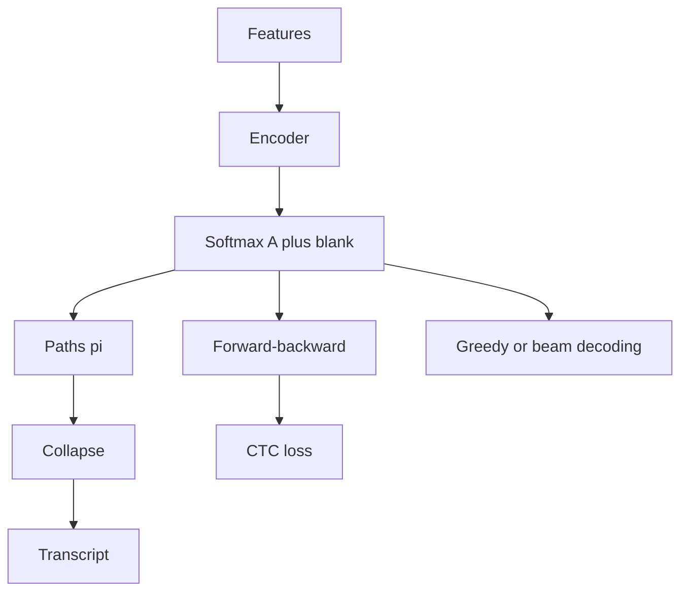

# CTC for Speech Recognition

Source: `DL_exam.pdf`, Question 49

Original question:

> CTC для распознавания речи. Blank token, collapse operation, CTC loss, greedy/beam decoding.

## Главная идея

`CTC` (`Connectionist Temporal Classification`) нужен, когда есть аудио и транскрипция, но нет разметки "какой фрейм какому символу соответствует". Модель выдает распределение по токенам на каждом шаге, а CTC суммирует вероятности всех монотонных frame-level путей, которые после `collapse` дают правильную строку.

## Минимум для ответа

- Вход: акустические признаки $x=(x_1,\dots,x_T)$. Target: $y=(y_1,\dots,y_U)$, обычно $U \ll T$.
- Расширенный алфавит: $\mathcal{A}'=\mathcal{A}\cup\{\varnothing\}$, где $\varnothing$ - `blank`.
- `Blank` не равен пробелу: это метка "не emit-ить новый токен".
- Путь $\pi=(\pi_1,\dots,\pi_T)$ - последовательность меток из $\mathcal{A}'$.
- `Collapse` $\mathcal{B}$: сначала схлопнуть подряд идущие одинаковые метки, затем удалить blanks.
- Пример: `blank c c blank a t t` $\to$ `cat`; `l l` $\to$ `l`, но `l blank l` $\to$ `ll`.
- CTC предполагает монотонное выравнивание и условную независимость frame-level меток при данном входе.
- Ограничения: слабое языковое моделирование без LM, только монотонные задачи, нужны временные шаги для target и повторов.

## Формулы / схема

Модель выдает $p_t(k)=P(\pi_t=k\mid x)$ для $k\in\mathcal{A}'$.

$$
P(\pi\mid x)=\prod_{t=1}^{T}p_t(\pi_t)
$$

$$
P(y\mid x)=\sum_{\pi:\mathcal{B}(\pi)=y}\prod_{t=1}^{T}p_t(\pi_t)
$$

$$
\mathcal{L}_{\text{CTC}}(x,y)=-\log P(y\mid x)
$$

Сумму считают `forward-backward` DP по $z=(\varnothing,y_1,\varnothing,\dots,y_U,\varnothing)$, обычно в log-space; сложность после encoder примерно $O(TU)$.

`Greedy decoding`: $\hat{\pi}_t=\arg\max_k p_t(k)$, затем $\hat{y}=\mathcal{B}(\hat{\pi})$. Быстро, но выбирает лучший путь, а не лучшую строку.

`Beam decoding`: хранит top-$B$ префиксов, отдельно blank и non-blank окончания; может добавлять LM score.

## Диаграмма

## Уточнения экзаменатора

- Зачем blank? Чтобы покрывать фреймы без нового символа, растягивать звуки и разделять одинаковые соседние символы.
- Почему greedy не оптимален? CTC score строки - сумма по путям, а greedy берет локальный argmax по фреймам.
- Чем beam лучше? Он суммирует вероятности префиксов и может использовать language model.
- Когда CTC применим? Когда порядок output соответствует порядку input.

## Частые ошибки

- Путать `blank` с пробелом между словами.
- Удалять blank до схлопывания повторов.
- Говорить, что CTC обучается по одному лучшему alignment.
- Считать greedy decoding оптимальным для $P(y\mid x)$.
