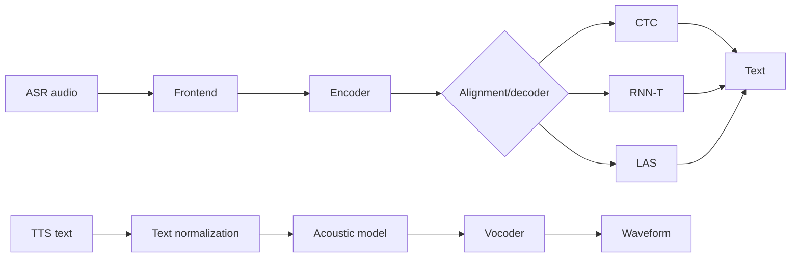

# ASR and TTS Architectures

Source: `DL_exam.pdf`, Question 50

Original question:

> Архитектуры ASR и TTS. RNN-T/LAS как альтернативы CTC; TTS pipeline: text normalization, acoustic model, vocoder.

## Главная идея

`ASR` переводит звук в текст при неизвестном alignment между кадрами и токенами; архитектуры различаются способом выравнивания. `TTS` решает обратную задачу: текст делают произносимым, acoustic model строит акустическое представление, `vocoder` синтезирует waveform.

## Минимум для ответа

- ASR pipeline: waveform $\rightarrow$ log-mel/MFCC или learned frontend $\rightarrow$ encoder $\rightarrow$ decoder/loss $\rightarrow$ текст.
- Encoder: BiLSTM, Transformer, Conformer; Conformer сочетает self-attention и convolution.
- `CTC`: blank + схлопывание повторов; суммирует монотонные пути; быстрый, но слабо моделирует языковые зависимости.
- `RNN-T`: acoustic encoder + prediction network + joint network. Blank двигает время, токен двигает выход; подходит для streaming и учитывает $y_{<u}$.
- `LAS`: Listen-Attend-Spell, encoder-decoder с attention; авторегрессионный, обычно offline, возможны пропуски/повторы.
- TTS pipeline: `text normalization` $\rightarrow$ linguistic frontend/G2P $\rightarrow$ acoustic model $\rightarrow$ vocoder $\rightarrow$ waveform.
- Acoustic model: Tacotron-like AR attention, FastSpeech-like non-AR duration model, VITS/flow/diffusion; обычно предсказывает mel-spectrogram, duration, pitch, energy или acoustic tokens.
- Vocoder: WaveNet-like AR, GAN, diffusion, neural codec decoder; цель -- естественный waveform.

## Формулы / схема

ASR decoding:

$$
\hat{Y}=\arg\max_Y P(Y \mid X)
$$

CTC:

$$
P_{\text{CTC}}(Y \mid X)=\sum_{\pi:B(\pi)=Y}\prod_{t=1}^{T}P(\pi_t \mid h_t)
$$

LAS:

$$
P_{\text{LAS}}(Y \mid X)=\prod_{u=1}^{U}P(y_u \mid y_{<u}, c_u), \quad c_u=\sum_t \alpha_{u,t}h_t
$$

TTS:

$$
\hat{M}=f_\theta(\text{text/phonemes}), \quad \hat{w}=v_\phi(\hat{M})
$$

## Диаграмма

## Уточнения экзаменатора

- Почему CTC нужен blank? Для пауз, растянутых токенов и границ без frame-level alignment.
- Чем RNN-T лучше CTC? Prediction network видит историю выходов, как встроенная language model.
- Почему LAS хуже для streaming? Attention обычно смотрит на весь вход.
- Что делает text normalization? Раскрывает числа, даты, сокращения и символы в произносимую форму.
- Как оценивают качество? ASR: WER/CER; TTS: MOS, intelligibility, naturalness, speaker similarity, latency.

## Частые ошибки

- Называть CTC немонотонным: он суммирует монотонные alignment-пути.
- Путать RNN-T и LAS: RNN-T идет по решетке $(t,u)$ с blank, LAS использует attention decoder.
- Считать vocoder языковой моделью: он генерирует waveform из acoustic representation.
- Пропускать frontend TTS: без normalization модель неправильно читает числа, даты и сокращения.
