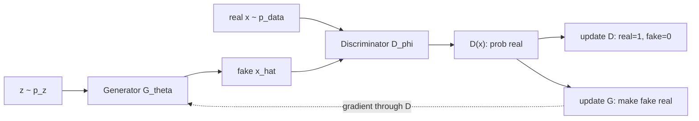

# Generative Adversarial Networks GAN

Source: `DL_exam.pdf`, Question 52

Original question:

> GAN. Генератор, дискриминатор, adversarial objective, min-max игра, основные проблемы обучения.

## Главная идея

`GAN` учит генеративную модель без явной плотности $p_\theta(x)$: генератор $G$ превращает шум $z \sim p_z$ в fake sample $\hat{x}=G(z)$, а дискриминатор $D$ оценивает вероятность, что объект настоящий. Обучение - игра двух сетей: $D$ улучшает бинарную классификацию real/fake, $G$ учится обманывать $D$. В идеале $p_g=p_{\text{data}}$, и лучший дискриминатор выдает $D(x)=0.5$.

## Минимум для ответа

- $G_\theta: z \mapsto x$ индуцирует распределение $p_g$ в пространстве данных.
- $D_\phi(x)\in[0,1]$ - бинарный классификатор: real label $1$, fake label $0$.
- Это не обычная минимизация одного loss, а `min-max` динамика; качество градиента $G$ зависит от текущего $D$.
- При фиксированном $G$ оптимальный $D$ сравнивает плотности real и generated.
- Практически часто используют `non-saturating loss`, потому что классический minimax loss может давать слабый градиент, когда $D$ слишком уверен.
- Главные проблемы: `mode collapse`, vanishing gradients, нестабильные осцилляции, чувствительность к learning rate/архитектуре/балансу шагов, нет простого loss-критерия качества.

## Формулы / схема

Классическая objective:

$$
\min_G \max_D V(D,G)=
\mathbb{E}_{x \sim p_{\text{data}}}[\log D(x)]
+
\mathbb{E}_{z \sim p_z}[\log(1-D(G(z)))].
$$

Loss для минимизации дискриминатором:

$$
L_D=-\mathbb{E}_{x \sim p_{\text{data}}}[\log D(x)]
-\mathbb{E}_{z \sim p_z}[\log(1-D(G(z)))].
$$

Практический loss генератора:

$$
L_G^{NS}=-\mathbb{E}_{z \sim p_z}[\log D(G(z))].
$$

Оптимальный дискриминатор:

$$
D^*(x)=\frac{p_{\text{data}}(x)}{p_{\text{data}}(x)+p_g(x)}.
$$

При $D^*$ генератор минимизирует $JS(p_{\text{data}}\Vert p_g)$ с точностью до константы:

$$
V(D^*,G)=-\log 4+2JS(p_{\text{data}}\Vert p_g).
$$

## Диаграмма

## Уточнения экзаменатора

- Почему $D(x)=0.5$ в идеале? Потому что $p_g=p_{\text{data}}$, real и fake статистически неотличимы.
- Чем minimax loss хуже `non-saturating`? При сильном $D$ градиент minimax для $G$ может насыщаться.
- Что такое `mode collapse`? $G$ выдает малое число типов объектов и плохо покрывает моды данных.
- Почему loss GAN плохо отражает качество? Игроки меняются одновременно; низкий/высокий loss не гарантирует реалистичность и разнообразие.

## Частые ошибки

- Путать роли: $D$ максимизирует objective, $G$ влияет только на fake-часть.
- Говорить, что GAN явно оценивает likelihood.
- Считать сильный дискриминатор всегда полезным: он может убить градиент $G$.
- Игнорировать разнообразие сэмплов и обсуждать только визуальное качество.
