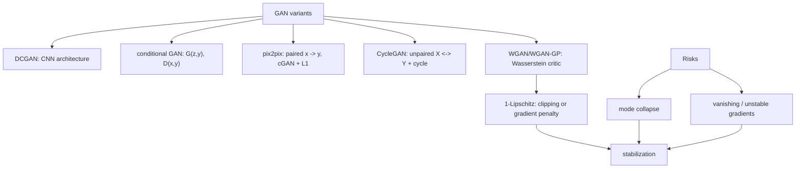

# GAN Variants and Stabilization

Source: `DL_exam.pdf`, Question 53

Original question:

> Варианты и стабилизация GAN. Mode collapse, DCGAN, conditional GAN, pix2pix, CycleGAN, WGAN/WGAN-GP.

## Главная идея

`GAN` - игра генератора $G$ и дискриминатора $D$: $G$ делает samples, похожие на данные, а $D$ отличает real от fake. Варианты GAN меняют архитектуру, условие генерации или loss, чтобы уменьшить нестабильность adversarial game.

## Минимум для ответа

- `Mode collapse`: разные $z$ дают однотипные outputs; качество может быть высоким, но diversity низкая.
- `DCGAN`: сверточные $G$ и $D$; strided conv / upsampling, batch norm, ReLU в $G$, LeakyReLU в $D$, `tanh` при нормировке $[-1,1]$.
- `conditional GAN`: генерация по условию $y$: $G(z,y)$, $D(x,y)$; условие - class label, text, mask, sketch, image.
- `pix2pix`: paired translation $(x,y)$; U-Net generator, PatchGAN discriminator, adversarial loss + $L_1$ для target.
- `CycleGAN`: unpaired translation; $G:X\to Y$, $F:Y\to X$, два дискриминатора и cycle consistency.
- `WGAN`: вместо BCE-game использует Wasserstein-1 distance; $D$ называется critic, не имеет sigmoid и должен быть 1-Lipschitz.
- `WGAN-GP`: заменяет грубый weight clipping на gradient penalty; обычно стабильнее, но дороже.
- Стабилизация: non-saturating/hinge/WGAN losses, spectral norm, gradient penalty, augmentation, баланс шагов $D/G$, TTUR, FID/diversity.

## Формулы / схема

$$
\min_G \max_D \mathbb{E}_{x\sim p_{\text{data}}}\log D(x)+
\mathbb{E}_{z\sim p_z}\log(1-D(G(z))).
$$

$$
L_G=-\mathbb{E}_{z\sim p_z}\log D(G(z)).
$$

$$
L_D=\mathbb{E}_{z}D(G(z))-\mathbb{E}_{x}D(x),\quad
L_G=-\mathbb{E}_{z}D(G(z)).
$$

$$
\lambda\mathbb{E}_{\hat{x}}(\lVert\nabla_{\hat{x}}D(\hat{x})\rVert_2-1)^2,\quad
\hat{x}=\epsilon x+(1-\epsilon)G(z).
$$

pix2pix: $L_{\text{cGAN}}+\lambda\lVert y-G(x)\rVert_1$. CycleGAN: adversarial losses + $\lambda_{\text{cyc}}\lVert F(G(x))-x\rVert_1+\lambda_{\text{cyc}}\lVert G(F(y))-y\rVert_1$.

## Диаграмма

## Уточнения экзаменатора

- Critic vs discriminator? Critic выдает score, а не вероятность real/fake.
- Зачем 1-Lipschitz critic? Это условие dual form для Wasserstein-1.
- Зачем pix2pix $L_1$? Для соответствия paired target.
- Почему CycleGAN без пар? Cycle consistency сохраняет информацию туда-обратно.

## Частые ошибки

- Называть pix2pix unpaired методом; unpaired - это CycleGAN.
- Думать, что mode collapse всегда означает плохие отдельные samples.
- Ставить sigmoid/BCE в WGAN critic.
- Путать weight clipping с gradient penalty.
- Судить о GAN только по loss без samples, diversity и FID.
